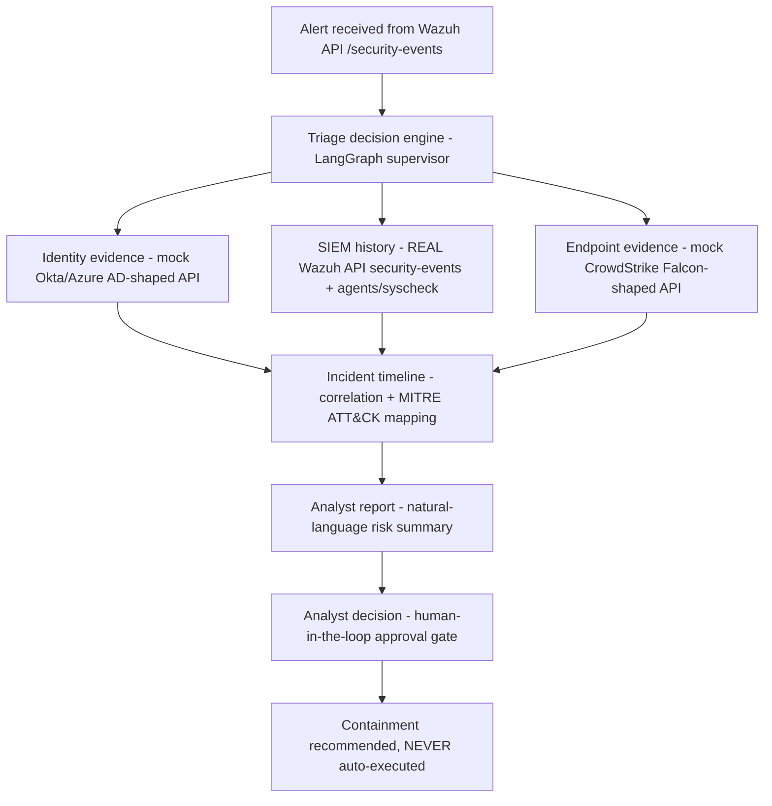

# Architecture Update — Real Wazuh as SIEM & Alert Source

**Project:** AI-Agentic SOC Triage & Investigation Engine
**Author:** Kyrell Green
**Status:** Adopted — supersedes the "mock SIEM" pillar in the Project Design Documentation v0.2
**Applies to:** 12-week build (weeks 1–12), evaluation criteria, and risk register

---

## 1. Change Summary

The SIEM pillar is no longer a locally simulated Splunk/FastAPI mock. It is replaced by
**the real Wazuh 4.14.7 single-node deployment already running in this project's SOC lab**
(Docker, hosted on the development Mac).

Wazuh is now **both** the alert source (where detections originate) **and** the historical
evidence pillar (SIEM history queries). Alert ingestion switches from a hand-fed
Splunk-ES-shaped JSON file to live pulls from the Wazuh API.

| Pillar | v0.2 Design (DRAFT) | Adopted Change |
|---|---|---|
| Alert ingestion | Static JSON alert modeled on Splunk ES / Sigma output | **Live from Wazuh API** (`GET /security-events`), normalized to the internal schema |
| SIEM history | Mock FastAPI service or local Splunk Free | **Real Wazuh API** — real correlated alerts, real agents, real MITRE-tagged rules |
| Identity evidence | Mock FastAPI service (Okta/Azure AD-shaped) | **Unchanged** — remains a schema-matched mock |
| EDR telemetry | Mock FastAPI service (CrowdStrike Falcon-shaped) | **Unchanged** — remains a schema-matched mock (supplemented by Wazuh syscheck/agent data where available) |
| Correlation → report → approval gate | LangGraph orchestration | **Unchanged** |

## 2. Why This Change

1. **The lab is already real.** The Wazuh stack (manager/indexer/dashboard), a monitored
   endpoint (Kali Linux in UTM with the Wazuh agent enrolled), and a working
   firewall/IDS/IPS pipeline (detect → decide → respond) already exist. Standing up a
   *second, fake* SIEM would duplicate infra and hide the lab's strongest asset.
2. **Stronger evaluation story.** Ground-truth evaluation no longer rests only on synthetic
   alerts — the agent can be exercised against **real detections** (e.g. the SSH brute-force
   rule `100010` / MITRE `T1110` already demonstrated in the lab) reproducing their content
   through the API.
3. **More portfolio-relevant skill surface.** Wazuh API integration shows: the REST API with
   JWT bearer auth, `q`-expression query filtering, pagination, agent/syscheck access, and
   schema normalisation between a real vendor format and an internal data model — exactly the
   kind of integration work a SOC engineering role does.
4. **Connector stays upgradeable.** The normalizer isolates Wazuh's shape from the agent's
   internal alert schema. Swapping Wazuh for a real Splunk/Elastic later (or adding them as a
   second source) is a new connector, not a rebuild — same property the v0.2 design claimed
   for swapping mocks to real APIs.

## 3. Revised Architecture

### 3.1 The lab (already live)

```
┌─────────────────────────── macOS (Docker Desktop) ───────────────────────────┐
│                                                                              │
│   Wazuh Manager 4.14.7   ────────────►   Wazuh Indexer (9200)                │
│        │  API :55000                                                         │
│        │  1514/1515 (agents)          Wazuh Dashboard (443)                  │
│        │                                                                     │
│        └── agent enrollment/events                                            │
│                                                                              │
└───────────────────────┬──────────────────────────────────────────────────────┘
                        │ TCP 1514/1515
               ┌────────▼────────┐
               │ Kali Linux (UTM) │  Wazuh agent enrolled
               │ 10.11.0.0/22     │  monitored endpoint
               └─────────────────┘
```

### 3.2 Investigation pipeline (revised)



Note the framing is unchanged from v0.2 Section 7: a SOC investigation workflow first,
an AI system second. Only the *evidence source wiring* of pillar C2 changed.

### 3.3 Data flow through the agent

1. Supervisors pulls an active detection from Wazuh (`GET /security-events`).
2. The Wazuh alert is normalized into the internal, tool-agnostic `Alert` schema
   (`schemas/alert.py`). MITRE mappings embedded in the Wazuh rule are preserved.
3. The triage decision engine chooses which evidence pillars this alert needs.
4. Identity and EDR lookups go to the mock services; SIEM history goes back to Wazuh
   (e.g. `GET /security-events?...` filtered by `src_ip`, `data.dstuser`, `agent.id`,
   or a time window).
5. All evidence is correlated into a timeline, mapped to MITRE ATT&CK, summarized in
   natural language, and routed to the analyst approval gate.

## 4. Wazuh Integration Details

| Item | Value |
|---|---|
| Version | Wazuh 4.14.7 (manager/indexer/dashboard, single-node Docker) |
| API base URL | `https://localhost:55000` (mapped from container port `55000`) |
| Auth flow | `POST /security/user/authenticate` (Basic auth) → JWT → `Authorization: Bearer` on all calls |
| Alert query endpoint | `GET /security-events` (successor of the legacy `/alerts`; filters via `q=`, `filters=`, `offset`/`limit`) |
| Semantic queries | `GET /agents` (list/enrollment), `GET /agents/{id}/summary`, `GET /syscheck/{id}` (file integrity where used) |
| TLS verification | off by default for localhost; controlled by `WAZUH_VERIFY_TLS` |
| Credentials | environment variables only (`WAZUH_API_USER`, `WAZUH_API_PASSWORD`), never committed |

### 4.1 Normalizer mapping (Wazuh alert → internal `Alert`)

| Internal field | Source (Wazuh API alert) |
|---|---|
| `rule_id`, `rule_name`, `rule_level` | `rule.id`, `rule.description`, `rule.level` |
| `groups` | `rule.groups` |
| `mitre` | `rule.mitre.id[]` / `rule.mitre.tactic[]` (per-technique) |
| `source_ip` | `data.srcip` (fallback: `data.src_ip`, log parse of `full_log`) |
| `dst_user` | `data.dstuser` (fallback: `data.user`) |
| `agent_id`, `agent_name`, `agent_ip` | `agent.*` |
| `raw_message` | `full_log` |
| `event_time` | `timestamp` (ISO-8601) |
| `source` | fixed: `wazuh` |

## 5. Tech-Stack Table (updated — SIEM row replaced)

| Category | Tool | Purpose |
|---|---|---|
| SIEM + alert source | **Wazuh 4.14.7 (real, Docker)** | Live detections + historical security-event queries via the REST API |
| Wazuh connectivity | `httpx` client with JWT auth and token caching | All agent-to-Wazuh calls |
| Identity evidence | FastAPI service, Okta/Azure AD-shaped (mock) | Synthetic user identity + login history |
| EDR evidence | FastAPI service, CrowdStrike Falcon-shaped (mock) | Synthetic endpoint process/network telemetry |
| Agent orchestration | LangGraph (LangChain) | Supervisor, correlation, synthesis; native HITL pause/resume |
| LLM | Anthropic Claude API (OpenAI fallback) | Planning, reasoning, natural-language reporting |
| Database | SQLite (MVP; `DATABASE_URL` swappable to Postgres) | Investigation state, reasoning-chain logs, evaluation results |
| Ground truth | Atomic Red Team mappings + labeled test set | Defensible MITRE labels for the test set |
| Dashboard | Streamlit | Alert queue, investigation reports, reasoning chain, approval UI |
| Observability | LangSmith | Step-by-step replay of agent decisions |

## 6. Risk-Register Additions (from Wazuh integration)

| Risk | Category | Mitigation |
|---|---|---|
| Wazuh API credentials/token exposed in logs or code | Security | Credentials from env only; tokens cached in memory with expiry; `.env` gitignored |
| Wazuh version API drift (endpoints change between 4.x minors) | Technical | All Wazuh calls isolated in `siem/`; single client module easy to bump; normalizer keeps internal schema stable |
| Real alert volume/query cost vs. LLM token budget | Technical / cost | Pre-filter and aggregate in Python before any LLM call; tiered model use; query limits server-side |
| Over-querying the live SIEM during demos (performance) | Ops | `limit`/`offset` caps, time-window filters, cached lookups per session |
| Localhost TLS self-signed cert warnings | Ops | `WAZUH_VERIFY_TLS=false` default for local; verify on for any remote deployment |

## 7. Impact on Evaluation Criteria

The v0.2 evaluation criteria stand, with one strengthening: **Functional completeness**
and **Measured accuracy** can now be demonstrated against a genuinely live SIEM
(real Wazuh alerts, e.g. MITRE `T1110` brute force), in addition to the synthetic
ground-truth test set of 20–50 alerts. Everything else (guardrail integrity 100%,
measured time savings, live VPS demo) is unchanged.

## 8. Explicitly Unchanged / Out of Scope

- Real Okta / Azure AD and CrowdStrike tenants remain **out of scope** for the 12-week MVP
  (identity + EDR stay mocks; connectors stay schema-compatible and swappable).
- Any automatic (non-approved) execution of containment actions remains impossible by design.
- The v0.2 goals (LLM tool-calling agent, safe self-contained environment, defensible
  measured outcome) are unchanged.