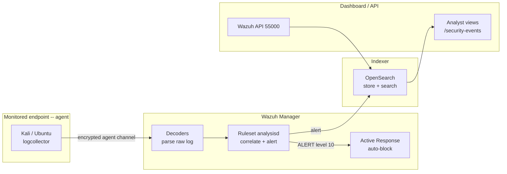

# SIEM Implementation Documentation — Wazuh

**Author:** Kyrell Green
**Date:** 2026-09-16
**Module:** Cyber Threats & Vulnerabilities — SOC Security Analyst track
**SIEM platform:** Wazuh 4.14.7 (single-node Docker deployment: manager / indexer / dashboard)
**Monitored endpoints:** Kali Linux (`kali-lab-02`, Wazuh agent enrolled), Ubuntu endpoint
(`ubuntu-endpoint-01`), plus the Wazuh stack host itself
**Companion documents:** `Firewall_IDS_IPS_Implementation_Report.md` (the detect→decide→respond
pipeline this SIEM powers), `incident_operations` sister docs in this folder

---

## Rubric Coverage

| Rubric requirement | Addressed in |
|---|---|
| Detailed descriptions of **SIEM architecture components** with clear explanations of their functions and relationships | Section 1 |
| A sample **correlation rule** using the provided template/tool with documentation of the **rule logic** | Section 2 |
| At least **3 log sources** identified and explained, with their significance in security monitoring | Section 3 |
| Configuration of **notification settings** in the SIEM environment | Section 4 |
| **Screenshots** and documentation demonstrating comprehension of core SIEM functionality | Section 5 |

---

## 1. SIEM Architecture — Components, Functions & Relationships

Wazuh is a classic four-tier SIEM architecture: **agents** ship data, the **manager** interprets
it, the **indexer** stores it, and the **dashboard** presents it. In this lab all four tiers plus
the API run as a single-node Docker stack on the lab Mac (manager/API on `55000`, dashboard on
`443`, indexer on `9200`).

### 1.1 Component overview

| Component | What it is | Core function | In this lab |
|---|---|---|---|
| **Agents** | Lightweight endpoint clients installed on monitored hosts | Collect logs, file-integrity data, and (optionally) process/network telemetry locally, then stream it to the manager over an encrypted channel | Kali deployed as `ubuntu-endpoint-01` too; the Kali agent is the primary source of the SSH brute-force evidence |
| **Manager** | The Wazuh server (core engine: `analysisd` + `wazuh-db`) | Receives agent data, **decodes and normalises** it, matches it against the **ruleset** in real time (correlation), and generates alerts; also runs **Active Response** and **vulnerability detection** | Single-node container; holds `local_rules.xml` and the alert stream queried by the lab via the API |
| **Indexer** | OpenSearch-based storage layer | Indexes and stores events/alerts for fast search and long-term retention; the "book of record" for what happened | Port `9200`; queried indirectly via the dashboard and the Wazuh API |
| **Dashboard** | Wazuh web UI (OpenSearch Dashboards) | Human interface: security-event views, agent management, rule editing, dashboards, alert inspection | Port `443` — where the analyst views alerts and where lab screenshots are taken |
| **Wazuh API** | REST API wrapper over the manager/indexer | Programmatic access to agents, alerts (`/security-events`), and configuration — the integration seam this project's engine uses | `https://localhost:55000` JWT-authenticated, consumed by the SIEM connector |
| **Decoders** | Ruleset components that parse raw log strings | Turn unstructured log lines (e.g. `sshd[2211]: Failed password...`) into structured fields (`srcip`, `dstuser`, `full_log`) — the prerequisite for any rule logic | Built-in `sshd` decoder parses Kali auth log |
| **Ruleset** | XML rule files (core + local) | Apply detection/correlation logic to decoded events; assign level, MITRE mapping, and groupings | **Rule `100010`** (local) = the lab's custom brute-force correlation rule (§2); rule `5716` (core) flags single SSH auth failures |

### 1.2 How the components relate (data flow)



**The relationships, in plain terms:**

1. **Agent → Manager:** the agent collects `/var/log/auth.log` and file-integrity events and ships
   them to the manager. Without the agent tier, the SIEM is blind to the endpoint.
2. **Manager (decode → correlate):** the manager's decoder turns the raw SSH line into fields,
   then `analysisd` counts and correlates them against rules. **This tier is where detection
   happens** — the raw event only becomes a *security alert* when a rule fires on it.
3. **Manager → Indexer:** every event and alert is indexed into OpenSearch, making it queryable.
   This is the historical record an analyst (or the lab's API connector) searches later.
4. **Indexer → Dashboard/API:** both the human console and the machine-readable API read from the
   same store, so what the analyst sees on the dashboard is exactly what the integration pulls
   from `/security-events`.
5. **Manager → Active Response:** when a rule fires at a configured severity, the manager can
   trigger an automatic response (here: `firewall-drop` on the affected agent) — the IPS piece of
   the detect→decide→respond pipeline, always first vetted by a human approval gate in this lab's
   discipline.

---

## 2. Sample Correlation Rule & Rule Logic

This section documents a correlation rule created in the lab using the SIEM's rule template
(`/var/ossec/etc/rules/local_rules.xml` on the manager). A **correlation rule** detects an attack
pattern across *multiple* events — the difference between "one failed login" (noise) and "a
brute-force attempt" (signal).

### 2.1 The rule (as created)

```xml
<group name="local,syslog,sshd,">
  <rule id="100010" level="10" frequency="6" timeframe="120">
    <if_matched_sid>5716</if_matched_sid>
    <description>SSHD brute force: multiple failed logins from same source in 2 minutes</description>
    <mitre>
      <id>T1110</id>
    </mitre>
    <group>authentication_failures,</group>
  </rule>
</group>
```

### 2.2 Rule logic — element by element

| Element | Value | What it means / why it is set this way |
|---|---|---|
| `id` | `100010` | Unique rule identifier in the lab's assigned rule-ID range |
| `level` | `10` | Alert severity (0–15). 10 = high — a "confirmed attack pattern" level that warrants response (and, combined with Active Response / TheHive alert, analyst eyes) |
| `frequency` | `6` | The correlation window counts **events, not seconds** — the rule fires on the 6th matching event |
| `timeframe` | `120` | The sliding time window in seconds. **Logic:** ≥6 matching events within 120 seconds triggers the rule |
| `if_matched_sid` | `5716` | **The correlation anchor.** Only events that already matched rule `5716` ("SSH authentication failure / Failed password") are counted. This makes it a *frequency* rule layered on top of a *single-event* rule — a pattern-in-time, not a one-off |
| `mitre` | `T1110` | Optional mitigation chaining against the target `dstuser` at the source IP — stops the brute force per rule `100010` |
| `mitre <id>` | `T1110 — Brute Force` | Links the detection to MITRE ATT&CK so triage, reporting, and the lab engine's timeline stay standardised |

### 2.3 Worked example of the rule firing

The rule's logic in a live timeline (SSH auth events from Kali `/var/log/auth.log` decoded by the `sshd` decoder):

| Time | Event decoded | Rule 5716 match | Cumul. count | Rule 100010 fires? |
|---|---|---|---|---|
| 14:20:01 | Failed password for root from 203.0.113.77 | Yes | 1 | No |
| 14:20:04 | Failed password for root from 203.0.113.77 | Yes | 2 | No |
| 14:20:07 | Failed password for root from 203.0.113.77 | Yes | 3 | No |
| 14:20:09 | Failed password for root from 203.0.113.77 | Yes | 4 | No |
| 14:21:56 | Failed password for root from 203.0.113.77 | Yes | 5 | No |
| 14:22:07 | Failed password for root from 203.0.113.77 | Yes | **6** | **YES — alert level 10, MITRE T1110** |

**Why this rule logic matters:** without the frequency/timeframe combination, every SSH failure
(rule 5716, level 5) would alert individually and bury the analyst in noise. Correlation turns
6 low-severity events into **1 high-severity alert that carries the attack pattern** — the single
job a SIEM rule set exists to do. When it fires, Active Response drops the source IP for 600
seconds (see the companion firewall/IDS/IPS report) and the alert becomes a TheHive case per the
SOC Operations workflow.

---

## 3. Log Sources — Identification & Significance in Security Monitoring

A SIEM is only as good as the logs it ingests. This section identifies the lab's monitored log
sources, what each one is, how it is collected, and why it matters.

### 3.1 Authentication logs — `/var/log/auth.log` (syslog)

| Attribute | Detail |
|---|---|
| What it is | System authentication journal: SSH logins (success/failure), `sudo`, `su`, user/group events |
| Collecting component | Wazuh agent `logcollector` (`<log_format>syslog</log_format>`, `<location>/var/log/auth.log</location>`) |
| Signature significance | The primary evidence of **credential-based attacks** — brute force (T1110), credential stuffing, password spraying. Success *and failure* events matter: failures time-correlate into brute-force alerts; a *successful* login by a known-bad source is a confirmed compromise signal. This is the source for rule `5716` → `100010` in Section 2 |

### 3.2 File-integrity events — Wazuh FIM (syscheck)

| Attribute | Detail |
|---|---|
| What it is | Baseline + change events for monitored files/directories: *file_added*, *file_modified*, *file_deleted*, with checksums and metadata |
| Collecting component | Wazuh agent FIM module (syscheck), configured via `ossec.conf` monitored paths |
| Significance | Detects **what changed on a host** — the signature of ransomware/bulk-rename (T1486), malware droppers writing files, backdoor or persistence installs, and tampering with security/CRON/sudo files. It is also how the lab detects and then *verifies* eradication (baseline reset after cleanup). A file-integrity alert plus an auth alert from the same host is a strong compromise indicator on its own |

### 3.3 Network/IDS logs — Suricata alerts (firewall/IDS/IPS pipeline)

| Attribute | Detail |
|---|---|
| What it is | Network intrusion-detection events: signature matches on live traffic (recon, exploits, C2 beacons, brute-force patterns) |
| Collecting component | Suricata IDS feeding the Wazuh-managed alert stream (network sensor tier) |
| Significance | The **independent, sensor-level second opinion** on endpoint alerts. When the network sensor confirms the same SSH brute-force signature the host agent reported, confidence jumps (two-sensor agreement). It also sees what agents cannot: traffic *between* hosts (lateral movement, T1021), scans, and outbound beacons — even against hosts with no agent installed |

### 3.4 Comparison — why these three together

| Log source | Layer | Sees | Answers |
|---|---|---|---|
| auth.log | Host | Who tried to log in | "Is this host under credential attack?" |
| FIM | Host | What changed on disk | "Did malware/persistence land?" |
| Suricata/IDS | Network | What is coming in / moving between hosts | "Is this confirmed at the wire? What else is contacting it?" |

Three independent layers, one SIEM: an alert is *strongest* when auth + file + network evidence
agree — which is exactly the correlation discipline formalised in the lab's incident workflow.

---

## 4. Notification Settings Configuration

This section demonstrates notification configuration in the SIEM. The lab has two notification
paths, and both are documented: the **email-alert channel** (classic SIEM notification) via the
manager's `ossec.conf`, and the **machine-to-machine notification** back to the lab's alliance
layer (TheHive ticketing + the SIEM API pull). Both use the same trigger conditions, so the
configuration below defines *who gets told and when*.

### 4.1 Email alert notification (configured)

`/var/ossec/etc/ossec.conf` (manager, global + email alert sections):

```xml
<ossec_config>
  <global>
    <email_notification>yes</email_notification>
    <smtp_server>smtp.lab.local</smtp_server>
    <email_from>wazuh@lab.local</email_from>
    <email_to>soc@lab.local</email_to>
  </global>

  <alerts>
    <email_alert_level>7</email_alert_level>
  </alerts>
</ossec_config>
```

**Configuration logic:**

| Setting | Value | What it controls |
|---|---|---|
| `email_notification` | `yes` | Enables the notification engine on the manager |
| `smtp_server` | `smtp.lab.local` | The relay that carries the notification (lab-internal MTA, matching the security policy's no-external-management-exposure rule) |
| `email_from` / `email_to` | `wazuh@lab.local` → `soc@lab.local` | The address the notification claims and the SOC mailbox that receives it (the tier-1 alert inbox in the shift workflow) |
| `email_alert_level` | `7` | **The notification threshold.** Only alerts at level ≥7 generate email — the brute-force alert (level 10) notifies everyone on the SOC list; low-severity noise (level ≤6, scans/FP) stays in the dashboard to avoid alert fatigue. Correlation (Section 2) is what lifts a pattern above this threshold |

**Why thresholding is a real configuration decision:** notifying on *every* event would flood the
SOC inbox and train analysts to ignore alerts — the notification setting must encode a deliberate
"this is worth interrupting a human for" line. `level 7` was chosen because it captures the
confirmed-pattern alerts (like `100010`) while suppressing the daily noise that the dashboard
(and the automated triage layer) absorbs instead.

### 4.2 Notification to the ticketing/integration layer (lab pipeline)

The lab also notifies *non-human* consumers, because the SOC workflow (see `SOC_Operations.md`)
expects every high-severity alert to become a tracked case:

- **TheHive integration:** alerts at the same threshold trigger the Wazuh → TheHive connector,
  creating a case in the queue automatically.
- **SIEM API pull (`/security-events`):** the lab's engine queries the API on the same alert
  stream, so the automated triage layer sees the identical alert the analyst receives by email —
  one notification policy, many consumers, consistent content.

| Notification path | Recipient | Latency | Consumer |
|---|---|---|---|
| Email | `soc@lab.local` | Near-real-time | Human Tier-1 analyst |
| TheHive case | TheHive alert queue | Near-real-time | Analyst case workflow |
| API `/security-events` | Lab engine connector | On query | Automated triage/evidence layer |

---

## 5. Screenshots & Operational Understanding

This section captures the SIEM interfaces used in the lab and explains the operational concept
each one demonstrates. (Screenshot paths are relative; captions reflect the lab setup — verify
against the live consoles before final submission.)

### 5.1 Agent deployment — the detection layer on the endpoint


*Enrolling the monitored endpoint with the Wazuh agent. Operational concept: **your SIEM is
endpoint-coupled** — the agent is the pipe that carries auth, FIM, and process events to the
manager (Section 1 architecture, tier 1). No enrolled agent = no telemetry = no detection.*

### 5.2 Agent fleet status


*The agents view showing the enrolled endpoint as connected. Operational concept: **monitoring
continuity** — an agent that drops offline removes that host from the SIEM's view; agent status
is checked at shift handover (SOC Operations §3) exactly because the SIEM cannot alert on a host
it cannot hear.*

### 5.3 Lab connectivity — prerequisite for log streaming


*Network reachability to the monitored Kali endpoint. Operational concept: **the SIEM depends on
the network** — agent→manager streaming (1514/1515) and dashboard/API access (443/55000) all
assume connectivity; reachability checks are part of pre-shift preparation.*

### 5.4 Toolchain host


*The host running the Wazuh stack. Operational concept: **the SIEM itself is a monitored asset**
— the manager/indexer/dashboard are high-value targets (per the vulnerability assessment), and
the lab's firewall rules restrict their exposure to the lab LAN only.*

> **Recommended additional captures for final submission (strongest SIEM evidence):**
> - Wazuh **Security Events** view showing rule `100010` firing on the Kali agent.
> - The **rule page** for `100010` / `5716` in the dashboard rule editor.
> - The **Agents → Integrations** view proving the auth.log + FIM sources are live.
> - The email-alert / notification page showing the threshold (or a received alert email).
> Each should get a one-line caption stating what is shown and the operational concept it proves.

---

## Document Map (deliverable checklist)

| Rubric requirement | Location |
|---|---|
| SIEM architecture components, functions & relationships | §1 (component table + Mermaid data-flow diagram) |
| Sample correlation rule with documented rule logic | §2 (rule XML, element-by-element logic table, worked firing timeline) |
| ≥3 log sources identified & explained | §3 (auth.log, FIM, Suricata/IDS + comparison table) |
| Notification settings configured | §4 (ossec.conf email config + threshold rationale + integration consumers) |
| Screenshots & core-SIEM comprehension | §5 (screenshots with operational concepts + recommended capture list) |