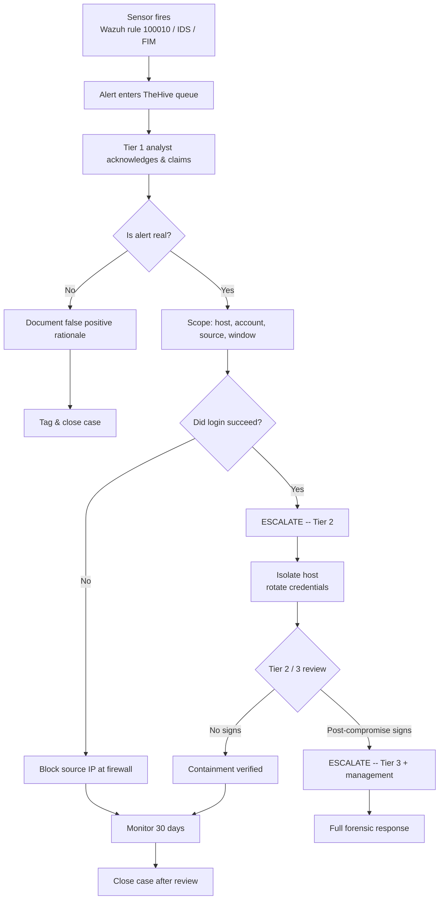
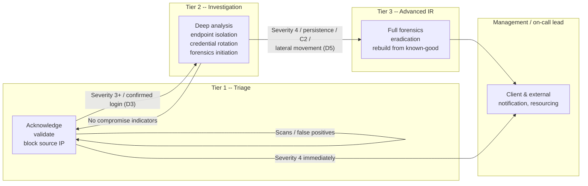

# SOC Operations Documentation

**Author:** Kyrell Green
**Date:** 2026-09-16
**Module:** Cyber Threats & Vulnerabilities — SOC Security Analyst track
**Lab environment:** AI-Agentic SOC lab — Wazuh 4.14.7 SIEM (Docker, single-node), TheHive case
management, Kali Linux endpoint (`kali-lab-02`) with Wazuh agent, firewall/IDS/IPS pipeline,
mock EDR layer.
**Companion documents:** `Incident_Response_Plan.md`, `Incident_Response_Methodology.md`

---

## Rubric Coverage

| Rubric requirement | Addressed in |
|---|---|
| Understanding of essential SOC tools — SIEM, ticketing platforms, monitoring solutions — with clear explanations of purpose and function | Section 1 |
| SOC workflows documented using a **Mermaid diagram** — alert handling procedures and escalation paths | Section 2 |
| Comprehensive documentation of **shift transition procedures** and handover requirements | Section 3 |
| Detailed **incident handling steps** using the provided template | Section 4 |
| **Screenshots of tool interfaces** and clear explanations of **operational concepts** | Section 5 |

---

## 1. Essential SOC Tools — Purpose and Function

A Security Operations Center is a team *and* a toolchain. The three tool categories this rubric
asks about — **SIEM, ticketing (case management), and monitoring** — are the backbone of that
toolchain. Each has a distinct job, and a working SOC the size of this lab runs all three
together: the **SIEM detects**, the **ticketing platform tracks**, and **monitoring watches**
continuously to detect what the SIEM rules haven't fired on yet.

### 1.1 SIEM system — Wazuh

| Question | Answer |
|---|---|
| What it is | A Security Information and Event Management system (`Wazuh 4.14.7`, self-hosted single-node Docker deployment in this lab) |
| Core function | **Centralised collection, normalisation, correlation, and alerting on security-relevant events** from agents (endpoints), infrastructure, and network sensors |
| Data it consumes | Agent-shipped log data (auth, process, file-integrity events) plus API traffic; raw events are normalised into a common schema and stored (indexed) for search |
| What it produces | **Alerts** — correlated events that match rule logic. In this lab the SSH brute-force rule **100010** (repeated failed logins in 2 minutes, level 10, MITRE T1110) and the per-event auth rule **5716** fire against the Kali endpoint |
| Operational purpose | Turns noisy raw logs into *decision-ready detections*; provides the search/forensics back-end ("what else hit this host?") and the audit trail for later investigation |
| Access | Web dashboard + REST API. The AI-Agentic SOC engine pulls alerts from `GET /security-events` |

**Why it is essential:** without a SIEM, an analyst cannot see across hosts, correlate a
repeated pattern, or answer historical questions about a single IP or account. Wazuh is the
"single pane of glass" for detection in this lab.

### 1.2 Ticketing platform — TheHive

| Question | Answer |
|---|---|
| What it is | An open-source **case-management / alert-triage (ticketing) platform** — the SOC's system of record for work items |
| Core function | Turns detections into **tracked, assigned, documented work packages (cases)** — each with severity, status, assignee, tags, tasks, observables, and an append-only audit timeline |
| Where it sits | Downstream of the SIEM: Wazuh alert (SIEM) → TheHive alert queue (ticketing) → analyst claims → case → investigation → close |
| What it produces | Cases (`#142`), subtask checklists (runbook enforcement), observables tied to IoCs, MITRE TTP tags, SLA visibility via dashboards |
| Operational purpose | **Ownership and accountability.** Prevents two analysts working the same alert, enforces runbook discipline via tasks, and produces the documentation/audit trail that incident response legally and ethically requires |

**Why it is essential:** detection without tracking is just noise. The ticketing layer makes an
alert *someone's job*, puts a clock on it (SLA), and guarantees every step is written down with
a timestamp and a responsible person.

### 1.3 Monitoring solutions

Monitoring is what keeps watching *between and after* detections. In this lab it has three layers:

| Monitoring layer | Tool | Purpose & function |
|---|---|---|
| Host-based file monitoring | **Wazuh FIM (syscheck)** | Watches monitored paths for file changes (adds/modifies/deletes). Catches malware drops, ransomware mass-renames, and tampering *before* (or as) they happen — the "what changed on this host?" layer |
| Network monitoring / IDS | **Suricata (firewall/IDS/IPS pipeline)** | Inspects traffic at the wire level for known-bad signatures. Confirms or refutes host-based alerts from a second, independent sensor — e.g. corroborating the SSH brute-force signature |
| Endpoint detection (EDR layer) | **Mock EDR API (Falcon-shaped) + process/network telemetry** | Process trees, network connections, opened files per endpoint. The post-compromise telemetry layer: "(mass file renames / outbound beaconing / new processes) — is this host behaving like a compromised host?" |

**Operational purpose of monitoring as a category:** defense-in-depth. The SIEM correlates and
alerts; monitoring layers keep independent eyes on files, wire, and endpoint behaviour so that a
rule gap in one layer is caught by another. This is how the SSH brute-force result in this lab
is *confirmed* (host + network agreement) instead of merely *suspected*.

### 1.4 Tool summary table

| Category | Tool | One-line job |
|---|---|---|
| SIEM | Wazuh 4.14.7 | Collect, correlate, and alert on security events across endpoints |
| Ticketing / case mgmt | TheHive | Track, assign, and document every alert as an auditable case |
| Monitoring (host) | Wazuh FIM | Detect file and config changes on endpoints |
| Monitoring (network) | Suricata IDS | Detect known-bad traffic at the wire level |
| Monitoring (endpoint) | EDR layer (mock) | Watch process/network/file behaviour for post-compromise signs |

---

## 2. SOC Workflows — Alert Handling & Escalation (Mermaid)

This section documents the standard SOC workflow — from the moment a sensor fires to the moment
a case is closed — using Mermaid diagrams. A workflow documented this way is unambiguous,
trainable, and auditable: any analyst can point at the exact box their current action fills.

### 2.1 Alert handling procedure

**Reading the diagram:** every alert is *acknowledged* (ownership + SLA clock start), *triaged*
(real vs. false positive), *scoped*, and only then acted on. Escalation is a defined decision
point (the diamonds), not a gut feeling. Note the two loops that return work to monitoring: a
false positive is documented and closed; a contained-but-not-compromised incident goes to an
elevated monitoring window before closure.

### 2.2 Escalation paths

**Escalation triggers (what moves a case up):**

| Decision point | Trigger | Moves to |
|---|---|---|
| D1 — in scope? | Duplicate / not in scope | Close/merge, no escalation |
| D2 — real attack? | Confirmed false positive | Document + close |
| D3 — any login succeeded? | **Yes** | Mandatory Tier 2 (confirmed unauthorized access) |
| D4 — isolate host? | Compromise confirmed | Tier 2/3 executes isolation |
| D5 — post-compromise signs? | Persistence / C2 / lateral movement | Mandatory Tier 3 + management + notification protocol |
| SLA over-run | Case open past target (High/Critical: 4h initial response, 24h containment) | Automatic escalation one tier |

These decision points mirror the fully expanded runbook in
`Incident_Response_Methodology.md` §3.

---

## 3. Shift Transition & Handover Procedures

A SOC never sleeps: work moves between shifts, and the only thing that moves with it is
*documentation*. A shift handover exists to ensure that **no active incident, no open case, and
no half-finished investigation is lost between analysts**. This section defines the procedures
for the start of shift, during shift, and — most importantly — the shift-to-shift handover.

### 3.1 Pre-shift preparation (incoming analyst, T-15 to T0)

The incoming analyst prepares before they own anything:

| Step | Action | Purpose |
|---|---|---|
| 1 | Record shift start time; log in to Wazuh, TheHive, and monitoring consoles | Verified access before taking responsibility |
| 2 | Review **open cases** in TheHive (filter: open, in-progress, awaiting-review) | Know what is already being worked |
| 3 | Review the **handover log** from the previous shift (Section 3.3) | Inherit context written by the outgoing analyst |
| 4 | Check **escalation/SLA clocks** — any case close to breaching its target? | Prioritise work by risk, not arrival order |
| 5 | Check active **elevated monitoring windows** (hosts under 30-day watch) | Resume scheduled checks without gaps |
| 6 | Skim overnight alerts for anything missed / unpreviewed | Catch anything the previous shift didn't |
| 7 | Confirm on-call contact list + escalation channel is current | Escalation must never stall on "who to call" |

### 3.2 During-shift responsibilities

- Keep every working case's TheHive timeline updated **as actions happen** (never batch-update at
  the end).
- Log any decision that changes severity/priority immediately — the escalation path depends on it.
- Give the handover log updates for any case you are actively working (status, next step, blocker).
- Escalate immediately per Section 2.2 — never wait to accumulate "a few" escalations for the
  next shift.

### 3.3 Shift handover — requirements & procedure

The handover happens at a fixed time (e.g. 15 min before shift end) between outgoing and
incoming analysts, and it produces a **written handover document** — verbal-only handovers are
not permitted in this SOC. The communication rule: *if it isn't written in TheHive, it isn't
handed over.*

**Outgoing analyst — 15 minutes before shift end:**

| Step | Action |
|---|---|
| 1 | Update every open case I own: status, last action, next expected step, blockers |
| 2 | Write the handover summary: open/at-risk cases, escalated incidents, elevated monitoring, false-positive notes |
| 3 | Flag **at-risk items**: cases near SLA breach, hosts under active watch, unresolved escalations |
| 4 | Complete the handover template (below) and post it in the handover channel + TheHive |
| 5 | Brief the incoming analyst verbally as a *summary of the document* — the doc stays authoritative |

**Incoming analyst — receives the handover:**

| Step | Action |
|---|---|
| 1 | Acknowledge receipt of the handover document |
| 2 | Confirm understanding of each open case + the at-risk list |
| 3 | **Take ownership in TheHive** — reassign open cases to self, update assignee/responsible fields |
| 4 | Verify SLA clocks and escalation calendar for the incoming shift |
| 5 | Ask questions *now* (the outgoing analyst is present); no "I saw it in the morning" surprises |

**Hard requirements for a valid handover (non-negotiable):**

1. **Written + traceable** — posted to the handover channel and mirrored in TheHive case timelines.
2. **Case-accurate** — every open case appears in the handover; no case is "closed unless someone
   remembers".
3. **Blocker-visible** — anything blocking an investigation is explicitly named, not implied.
4. **Owner-switched** — all open cases reassigned to the incoming analyst before the outgoing
   analyst leaves.
5. **Escalation-current** — any half-triggered escalation (e.g. awaiting Tier 2 review) is named
   explicitly so the incoming shift follows it up.

### 3.4 Shift handover template

| Field | Content |
|---|---|
| Shift | e.g. 06:00–14:00 UTC, 2026-09-16 |
| Outgoing analyst | Name |
| Incoming analyst | Name |
| Handover time | Timestamp |
| Open cases | Case #, title, status, next step, blocker |
| Escalated / at-risk items | Decision point reached, who is waiting on what, deadline |
| Elevated monitoring windows | Host, reason, window end date |
| False-positive notes | Rule, rationale, suggested tuning |
| Environment change | Deployments, config changes, new rules, API/console issues |
| Callouts / on-call | Anything that needs the on-call lead overnight |
| Signature | Outgoing + incoming analyst acknowledgement |

### 3.5 Why shift transition procedures exist (operational concept)

The SOC operates on **continuity of institutional memory**. A checklist + written handover makes
the SOC's next shift as knowledgeable as the last one without relying on memory. It is the same
"documentation first" principle that governs incident handling (§4): **if the handover is not
written down, the work effectively stops at shift change.**

---

## 4. Incident Handling Steps — the Provided Template

This section documents the standard **incident handling steps** — the ordered procedure an
analyst follows from notification to closure — using the provided incident-response template.
The template itself is fully completed for the lab's designated scenario (SSH brute force,
MITRE T1110) in `Incident_Response_Methodology.md` §4; what follows is the *step-by-step
handling procedure* that produces that template.

### 4.1 The incident handling procedure (10 steps)

| Step | Handling step | Action / output | Template section it feeds |
|---|---|---|---|
| 1 | **Detect & alert** | Sensor fires (Wazuh 100010/5716, IDS, FIM); alert lands in TheHive queue | Case record — source/reporter |
| 2 | **Acknowledge & open** | Tier 1 claims the alert; case opened with severity + template applied (SLA clock starts) | Case record — date/time detected, status |
| 3 | **Verify** | Confirm the detection is real; cross-check host + network sensors; preserve the original alert JSON unmodified | Case record — classification |
| 4 | **Scope** | Identify affected host(s), account(s), source IP(s), and the activity window | Case record — affected assets/accounts |
| 5 | **Triage severity** | Score severity × scope per the 1–4 model; set priority in TheHive | Case record — severity/priority |
| 6 | **Escalate if required** | Apply escalation decision points D1–D5 (Section 2.2) — e.g. confirmed login ⇒ Tier 2 | Case record — decision trail |
| 7 | **Contain** | Human-approved: block source at firewall, isolate host, disable/rotate credentials | Containment section of template |
| 8 | **Eradicate & recover** | Remove root cause / foothold; restore or verify baseline; re-enable services | Eradication & Recovery section |
| 9 | **Document evidence** | Record alert payloads, logs, telemetry, IoC enrichments in the case timeline | Evidence collected section |
| 10 | **Review & close** | Post-incident review, lessons learned, elevated monitoring window opened or case closed | Lessons learned / follow-up |

### 4.2 Where the completed template lives

The full template is **completed** (all fields filled to case-file detail) in:

> `Incident_Response_Methodology.md` §4 — Completed Incident Response Documentation Template:
> case record (§4.1), timeline (§4.2), evidence (§4.3), containment/eradication/recovery (§4.4),
> lessons learned (§4.5) — for SOC-CASE-2026-0142 (SSH brute-force on `kali-lab-02`).

---

## 5. Tool Interface Screenshots & Operational Concepts

This section includes screenshots of the actual tool interfaces used in this lab, each with an
explanation of the operational concept it demonstrates. (Screenshot paths are relative to this
document; image captions reflect the lab setup — verify against the live consoles before final
submission.)

### 5.1 SIEM — Wazuh agent deployment & fleet view

*Wazuh agent deployment — the endpoint enrolment command that connects `kali-lab-02` to the
manager over the Wazuh agent protocol. Operational concept: **agent-based telemetry is how the
SIEM sees the host**; without enrolled agents the manager has nothing to correlate.*

*Wazuh agent fleet view showing the enrolled endpoint as active/connected. Operational concept:
**agent status is the health metric of the detection layer** — an unconnected agent is a blind
spot, and T1 pre-shift checks (Section 3.1) include confirming agents are online.*

### 5.2 Monitoring — endpoint reachability / lab connectivity

*ICMP reachability test to the monitored Kali endpoint. Operational concept: **connectivity is
the prerequisite for monitoring continuity** — a host that stops responding may be down, isolated,
or compromised; connectivity checks are part of the elevated-monitoring routine after an
incident.*

### 5.3 Lab infrastructure — test server

*The lab test server environment hosting the SOC toolchain. Operational concept: **the SOC stack
is infrastructure that must be maintained and patched like any monitored asset** — the monitoring
tools are themselves monitored assets in a mature SOC.*

> **Note for final submission:** replace these captions with the specific detail visible in each
> screenshot (dates, agent names, rule IDs), and re-take any screenshot that names a console you
> prefer to present differently. Additional good candidates: the Wazuh dashboard security-events
> view (rule 100010 firing), a TheHive case page, and the IDS alert console.

---

## Document Map (deliverable checklist)

| Rubric requirement | Location |
|---|---|
| Essential SOC tools — SIEM, ticketing, monitoring — purpose & function | §1 (per-tool sections + summary table) |
| SOC workflows as a Mermaid diagram — alert handling + escalation | §2.1 and §2.2 (Mermaid `flowchart` diagrams + trigger table) |
| Shift transition procedures & handover requirements | §3 (pre-shift, during-shift, handover requirements, template) |
| Detailed incident handling steps using the provided template | §4 (10-step procedure + reference to completed template) |
| Screenshots of tool interfaces + operational concepts | §5 (lab screenshots with operational-concept captions) |