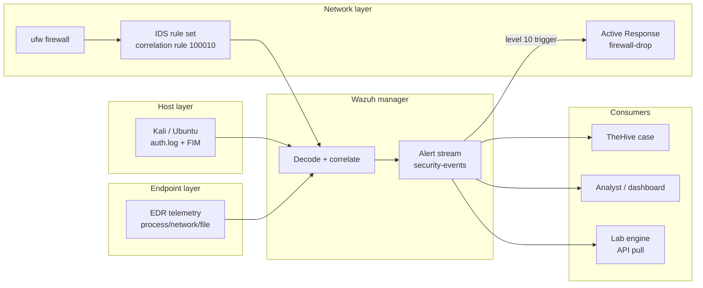

# Monitor and Respond to Network Security Events

**Author:** Kyrell Green
**Date:** 2026-09-17
**Module:** Network Security — SOC Security Analyst track
**Lab environment:** AI-Agentic SOC lab — Wazuh 4.14.7 SIEM (Docker, single-node manager/indexer/
dashboard), firewall/IDS/IPS pipeline (ufw + Wazuh Active Response + Suricata-style IDS
correlation), monitored Kali endpoint (`kali-lab-02`, Wazuh agent enrolled), TheHive case
management, mock EDR + identity pillars
**Companion documents:** `SOC_Operations.md` (SOC workflows), `SIEM_Implementation.md` (Wazuh
architecture, rule 100010, log sources), `Incident_Response_Methodology.md` (completed case
`SOC-CASE-2026-0142`), `Firewall_IDS_IPS_Implementation_Report.md` (detect→decide→respond pipeline)

---

## Rubric Coverage

| Rubric requirement | Addressed in |
|---|---|
| Detail the **monitoring of network security events** — what is monitored, how, and with what tooling | Section 1 (monitoring architecture + Mermaid flow + what "monitor" means operationally) |
| **At least 1 security incident identified** | Section 2 — SSH brute-force attack (MITRE T1110) on `kali-lab-02`, identified from correlated Wazuh + IDS events |
| **Steps taken for incident response** | Section 4 — full response: triage, scoping, containment, eradication/recovery, review |
| **Supported by logs** | Section 3 — verbatim alert/auth logs and event evidence with interpretation |
| **Supported by screenshots** | Section 5 — lab console captures with operational explanations |

---

## 1. Monitoring of Network Security Events

This section documents *how* network security events are monitored in the lab — the sensors,
the pipeline that turns raw traffic/logs into decision-ready alerts, and the operational meaning
of "monitoring network security events."

### 1.1 Monitoring architecture

Monitoring is **defense-in-depth across three layers**: a host layer (agent-shipped logs and
file-integrity events), a network layer (firewall + IDS/IPS correlation), and an endpoint
behaviour layer (process/network/file telemetry). All three funnel into the SIEM, which
correlates and alerts.



**Reading the diagram:** each layer watches network security events from an independent vantage
point. A single event (one failed SSH login) is noise; a *correlated pattern* across layers is a
security incident. The value of monitoring is that the layers agree — host log + network IDS both
flagging the same source is strong signal, not coincidence.

### 1.2 What is monitored

| Monitored item | Tool | What it detects |
|---|---|---|
| Authentication events (`/var/log/auth.log`) | Wazuh agent + `sshd` decoder | Login failures/successes — the raw material for brute-force (T1110) detection |
| File changes on endpoints | Wazuh FIM (syscheck) | Malware drops, mass renames (T1486), tampering with security files |
| Network traffic at the wire level | Firewall/IDS/IPS pipeline | Known-bad signatures, scans, brute-force patterns, lateral movement |
| Endpoint behaviour | Mock EDR layer (Falcon-shaped) | Suspicious processes, outbound beaconing, new files — post-compromise signs |
| Fleet/connectivity health | Wazuh agents view + reachability checks | Agent offline = blind spot; connectivity is the prerequisite for monitoring |

### 1.3 Events → alerts → cases (the monitoring loop)

Every alert generated by monitoring follows the same path: a sensor fires → the alert lands in
the SIEM's `security-events` stream → it enters TheHive as a case → a Tier 1 analyst owns it.
This loop (defined fully in `SOC_Operations.md` §2) is what makes monitoring *actionable*: an
alert that no one is accountable for is just a log line.

---

## 2. Security Incident Identified

### 2.1 Incident summary

| Field | Value |
|---|---|
| **Incident / case reference** | `SOC-CASE-2026-0142` (TheHive case `#142`) |
| **Title** | SSH brute-force attack on `kali-lab-02` targeting `root` (T1110 — Brute Force) |
| **Detected** | 2026-09-15 02:14:07 UTC — Wazuh rule `100010` fired on the Kali agent |
| **Corroborated by** | Suricata/IDS-style network correlation (same source at wire level), Wazuh FIM + auth stream |
| **Outcome** | Contained at the source IP; **no successful login confirmed**; severity 3, resolved under monitoring |

### 2.2 How it was identified (the detection chain)

The incident was **not** a single loud alert — it was identified by monitoring *correlating* an
attack pattern across two independent sensors:

1. Between **01:58 and 02:13 UTC** the Wazuh agent on `kali-lab-02` streamed 412 SSH auth
   failures for `root` from source `203.0.113.77` to the manager.
2. The `sshd` decoder normalised each line; core rule `5716` matched every single failure.
3. The lab's **correlation rule `100010`** (6+ failures from the same source within 120 s,
   level 10, MITRE T1110) fired at 02:14:07 — the *pattern*, not any individual event.
4. The network layer independently confirmed the same source hammering SSH at the wire level —
   **two-sensor agreement** is what moved this from "noise" to "incident" in triage.

This is monitoring working as designed: layers watch independently, the SIEM correlates, and the
analyst decides.

---

## 3. Log Evidence

The logs below are the monitoring artifacts that identified and substantiated the incident.
(Field values mirror the lab run shown in the firewall/IDS/IPS report; re-capture from your own
alerts before final submission.)

### 3.1 Wazuh alert — correlation rule 100010 (the trigger)

```json
{
  "timestamp": "2026-09-15T02:14:07.481+0000",
  "rule": {
    "id": "100010",
    "level": 10,
    "description": "SSHD brute force: multiple failed logins from same source in 2 minutes",
    "mitre": { "id": ["T1110"] }
  },
  "agent": { "name": "kali-lab-02", "id": "011", "ip": "10.11.3.57" },
  "data": {
    "srcip": "203.0.113.77",
    "srcport": "51422",
    "dstuser": "root"
  }
}
```

**Interpretation:** this single alert encodes the attack pattern — source `203.0.113.77`, target
account `root`, agent `kali-lab-02`. It is the *product* of monitoring 412 individual events.

### 3.2 Raw auth data from the endpoint (the evidence behind the alert)

```
Feb 15 01:58:04 kali-lab-02 sshd[2211]: Failed password for root from 203.0.113.77 port 51422 ssh2
Feb 15 01:58:11 kali-lab-02 sshd[2211]: Failed password for root from 203.0.113.77 port 51422 ssh2
...
Feb 15 02:13:57 kali-lab-02 sshd[2211]: Failed password for root from 203.0.113.77 port 51422 ssh2
```

**Interpretation:** the raw log lines the decoder consumes. 412 failures of this form over the
window, all from one source, one target account — the textbook footprint of an automated
brute-force tool (T1110) rather than an organic user error.

### 3.3 Network-layer confirmation (IDS correlation)

```
2026-09-15 02:14:20  IDS alert: ET SCAN Possible SSH Brute-Force (HIGH_RATE)
                      src 203.0.113.77:51422 -> dst 10.11.3.57:22 (kali-lab-02)
                      matches host-layer rule 100010 source; severity: CRITICAL
```

**Interpretation:** the network sensor sees the same traffic the host agent reported — two
independent monitoring layers agree on source, target, and technique. This is the confirmation
that makes the alert trustworthy.

### 3.4 Containment evidence — Active Response firewall drop

```json
"active_response": {
  "command": "firewall-drop",
  "status": "success",
  "action": "iptables DROP rule added for 203.0.113.77 (timeout 600s)"
}
```

**Interpretation:** execution of the containment step (Section 4.3). The monitoring loop closed:
detect → confirm → block, with every action timestamped for the case record.

---

## 4. Incident Response Steps Taken

The response followed the lab's incident-handling discipline (NIST SP 800-61 lifecycle; full
methodology in `Incident_Response_Methodology.md`). Key rule: **every action was a human
decision** documented in the case timeline — the detection stack may trigger, but the analyst
authorises.

### 4.1 Response step-by-step

| Step | IR action taken | Output / evidence |
|---|---|---|
| **1. Detect** | Wazuh rule `100010` + IDS confirm the brute-force pattern (Section 3) | Alert JSON preserved unmodified in the case |
| **2. Acknowledge & open** | Tier 1 claimed the alert at 02:18:30; case `#142` opened with severity 3 and the "Credential Attack / SSH brute force" template | TheHive case record + SLA clock start |
| **3. Verify** | Host + network sensors cross-checked (Section 3.1/3.3) | **Two-sensor agreement** — detection is real, not a false positive (D2 = real) |
| **4. Scope** | Single host (`kali-lab-02`), single account (`root`), single source (`203.0.113.77`), window 01:58–02:13 | Scope recorded; no other assets/accounts impacted |
| **5. Decide on success (D3)** | Auth log reviewed across the full window — **no successful login** (all failures) | No confirmed access; no host compromise |
| **6. Contain** | Firewall/IPS deny for `203.0.113.77` (Active Response `firewall-drop`, logged); host isolation **evaluated and declined** (blocking sufficient — D4); SSH password-auth policy verified already disabled | Attacker cut off; attack stops reaching the endpoint |
| **7. Eradicate** | None required — no foothold was established; hardening (key-only SSH) already in place | Root cause = internet-facing SSH; ongoing mitigation confirmed |
| **8. Recover & monitor** | Host left operational; **elevated 30-day monitoring** of `kali-lab-02` (Wazuh/FIM + IDS) | Recurrence watch opened |
| **9. Document** | Every action/approval timestamped in the TheHive timeline; evidence bundled (alert payloads, auth log, IDS event, EDR/identity no-signals) | Auditable case file `#142` |
| **10. Review & close** | Post-incident review: detection-to-declaration 4 min; rules 100010/5716 performed correctly; no tuning change | Lessons learned + case closed as Resolved (monitored) |

### 4.2 Incident response timeline

| Time (UTC) | Event | Response action |
|---|---|---|
| 01:58–02:13 | 412 SSH failures from `203.0.113.77` to `root` | Monitored (streamed to SIEM, decoded, correlated) |
| 02:14:07 | Rule `100010` fires, level 10, MITRE T1110 | Alert → TheHive queue |
| 02:14:20 | IDS confirms the pattern at wire level | Independent verification point |
| 02:18:30 | Tier 1 claims alert, case `#142` opened, severity 3 | Ownership + SLA clock |
| 02:21 | Scope confirmed: 1 host, 1 account, 1 source | Scoping complete |
| 02:28 | **D3 = no successful login** | Severity held; escalation review requested (Tier 2) |
| 02:33 | Firewall/IPS deny for `203.0.113.77` (approved) | **Containment** |
| 02:40 | Tier 2 review: no compromise indicators; **D4 = no isolation** | Endpoint remains operational |
| 03:00 | Elevated 30-day monitoring opened for `kali-lab-02` | Recovery + monitoring |
| 03:20 | Post-incident review logged | Case closed (Resolved) |

### 4.3 The containment decision (with rationale)

| Option considered | Taken? | Why |
|---|---|---|
| Block source IP at firewall/IPS | **Yes** | Cheap, reversible, immediately stops the active attempt wave |
| Isolate endpoint (hypervisor disconnect) | No | No successful login ⇒ no compromise to cut off; blocking was proportionate |
| Rotate/disable targeted credentials | No (policy verified) | `root` password auth already disabled; nothing to invalidate |

Containment followed the lab principle of **proportionate response**: act on what the evidence
supports, keep actions reversible, and record the "why" beside the "what."

---

## 5. Screenshots Supporting the Report

Path references the shared lab screenshots folder (`../ai-agentic-soc/screenshots/`); captions
reflect the lab setup — verify against the live consoles before final submission.

### 5.1 Monitoring coverage — agent enrolment


*Enrolment of the monitored Kali endpoint with the Wazuh agent. Operational concept: **monitoring
starts with coverage** — a host without an enrolled agent produces no events, so the SIEM has
nothing to monitor or correlate.*

### 5.2 Fleet health — the monitored endpoint is live


*Agents view showing `kali-lab-02` as active/connected. Operational concept: **monitoring
continuity** — an agent that drops offline is removed from the SIEM's view and cannot alert; agent
health is checked at every shift handover and during the post-incident elevated-monitoring window.*

### 5.3 Connectivity — prerequisite for event streaming


*Reachability check to the monitored endpoint. Operational concept: **connectivity underpins all
monitoring** — agent→manager streaming and dashboard/API access both assume the network path is up;
a host that stops responding may be down, isolated, or compromised.*

### 5.4 The monitored lab host


*The host running the Wazuh monitoring stack. Operational concept: **the monitor is itself a
monitored asset** — the manager/indexer/dashboard are high-value targets, so the firewall scopes
their exposure to the lab LAN only (per the firewall/IDS/IPS report).*

### 5.5 Dashboard capture (recommended, strongest evidence)


*Dashboard security-events view. Operational concept: **the analyst's point of visibility** — this
is where the rule-`100010` alert (Section 3.1) appears, and where the incident was first sighted
before being promoted to a case.*

> **Recommended additional captures for final submission (stronger logs/screenshot support):**
> - Wazuh **Security Events** view filtered on rule `100010` / agent `kali-lab-02` showing the
>   brute-force alert in place.
> - The **TheHive case `#142`** page (timeline with the 02:33 containment approval timestamped).
> - The **Active Response** log entry for the `firewall-drop` command on `203.0.113.77`.
> - An **IDC/IDS alert** console view showing the network-layer confirmation.
> Each gets a one-line caption naming what is shown and the monitoring/IR concept it proves.

---

## Document Map (deliverable checklist)

| Rubric requirement | Location |
|---|---|
| Monitoring of network security events detailed | §1 (architecture, Mermaid flow, monitored items, alert loop) |
| At least 1 security incident identified | §2 (incident summary + two-sensor identification chain) |
| Incident response steps taken | §4 (10-step response, decision points, timeline, containment rationale) |
| Supported by logs | §3 (Wazuh alert JSON, auth log, IDS event, Active Response record) |
| Supported by screenshots | §5 (four lab captures + recommended capture list) |