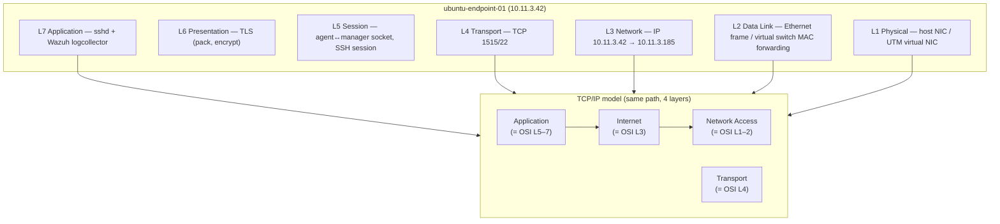

# Network Protocols and Architectures Report

**Author:** Kyrell Green
**Date:** 2026-09-17
**Module:** Network Security — SOC Security Analyst track
**Lab environment:** AI-Agentic SOC Home Lab — Wazuh 4.14.7 stack (manager/indexer/dashboard,
Docker) on macOS/UTM; monitored Linux endpoints (`kali-lab-02`, `ubuntu-endpoint-01`); LAN
`10.11.0.0/22`
**Companion documents:** `Network_Topology_Implementation_Report.md` (the LAN star topology),
`Firewall_IDS_IPS_Implementation_Report.md` (protocols in enforcement), `SIEM_Implementation.md`
(Wazuh components)

---

## Rubric Coverage

| Rubric requirement | Addressed in |
|---|---|
| Network diagram including the **OSI model and TCP/IP model for 1 device** | Sections 1–2 (diagram + per-device mapping for `ubuntu-endpoint-01`) |
| **Proper subnetting for 1 subnet** | Section 3 (subnetting worksheet + allocation table for `10.11.0.0/22`) |
| **Secure network architecture** with specific security protocols | Section 4 (protocols per layer + why they secure the architecture) |

---

## 1. Network Diagram

The lab's network diagram is delivered as an image (`Network Protocols and Architectures.png`) and
as the logical diagram in `Network_Topology_Implementation_Report.md` §2. Its content in summary:

- **Devices:** Mac host (NIC/uplink), UTM virtual switch, Wazuh manager/indexer/dashboard, Kali
  endpoint, Ubuntu endpoint.
- **Links:** bridged LAN links within `10.11.0.0/22`; edge NAT to the internet.
- **Models overlaid:** each device is annotated with the OSI layer it operates at, and the
  TCP/IP layer equivalents — e.g. the Wazuh agent↔manager channel (TLS over TCP) is mapped to
  Application/Transport in TCP/IP and Layers 5–7/4 in OSI.

While the full picture is in the image + topology companion, Section 2 zooms into **one device**
(the rubric's requirement) to show the model mapping in detail.

---

## 2. OSI & TCP/IP Model for One Device — `ubuntu-endpoint-01`

**Device chosen:** `ubuntu-endpoint-01` (10.11.3.42) — a Wazuh agent collecting SSH
authentication events. It is the single best device for this exercise because one event (an SSH
login attempt) can be traced through **every** layer while it travels across the LAN.

### 2.1 Device diagram — where the models live on the traffic path

### 2.2 Layer-by-layer mapping for this device

| OSI layer | What operates on it | TCP/IP equivalent | Example in this lab |
|---|---|---|---|
| **7 — Application** | `sshd`, Wazuh `logcollector`, agent services | Application | SSH login attempt received; auth failure written to `auth.log` |
| **6 — Presentation** | TLS encryption of the agent channel | Application | Log + FIM events encrypted for manager (AES); HTTPS to dashboard |
| **5 — Session** | Agent↔manager TLS session; SSH session state | Application | Session tracking Wazuh correlates (per-login state) |
| **4 — Transport** | TCP (1514/1515 agent, 22 SSH, 443 dashboard) | Transport | Port 22 attempt from `203.0.113.77`; port 1515 event delivery |
| **3 — Network** | IP routing within `10.11.0.0/22` | Internet | Packet `10.11.3.42 → 10.11.3.185` (agent→manager) |
| **2 — Data Link** | Virtual switch / Ethernet (MAC forwarding) | Network Access | Frame switched locally on the UTM virtual switch |
| **1 — Physical** | Host NIC / virtual NIC | Network Access | Physical bit transport on the lab host hardware |

**Reading this table:** the *same* end-to-end path is described twice — with 7 layers (OSI) and
with 4 layers (TCP/IP, which folds presentation+session into Application and data-link+physical
into Network Access). Both models agree on where the security protocols sit (Section 4):
encryption lives at Presentation/Application, delivery control at Transport, addressing and
segmentation at Network.

---

## 3. Proper Subnetting — `10.11.0.0/22`

The lab LAN uses one properly-subnetted block: `10.11.0.0/22`.

### 3.1 Subnetting worksheet

| Property | Value |
|---|---|
| Network address | `10.11.0.0` |
| Prefix length | `/22` |
| Subnet mask | `255.255.252.0` |
| Wildcard (inverse) mask | `0.0.3.255` |
| Number of subnet bits | 22 bits network, 10 host bits |
| Hosts per subnet | \(2^{10} - 2 =\) **1022 usable** |
| First usable address | `10.11.0.1` |
| Last usable address | `10.11.3.254` |
| Broadcast address | `10.11.3.255` |
| Valid host range | `10.11.0.1 – 10.11.3.254` |

**Mask math (why `255.255.252.0`):** /22 borrows 6 host bits from the 3rd octet of a /16,
making the third octet's block size \(2^{8-6} = 4\) → network at `10.11.*0*`, next boundary at
`10.11.*4*`, so the block spans `10.11.0.0 – 10.11.3.255`.

### 3.2 Address allocation on the subnet

| Purpose | Address(es) | Static/reserved? |
|---|---|---|
| Wazuh manager (indexer + dashboard) | `10.11.3.185` | Reserved (static) |
| Wazuh API / dashboard (same node) | `10.11.3.185` (TCP 55000/443) | Reserved |
| Kali endpoint (`kali-lab-02`) | `10.11.3.57` | Reserved (agent `011`) |
| Ubuntu endpoint (`ubuntu-endpoint-01`) | `10.11.3.42` | Reserved |
| Edge NAT / default gateway | `10.11.0.1` | Reserved |
| DHCP range (spares) | `10.11.2.1 – 10.11.2.254` | Dynamic |

The layout reserves the first address for the gateway, groups **management** hosts around
`.3.185`, keeps endpoints in a contiguous set, and leaves the `.2` block for dynamic assignment —
a deliberate structure that keeps firewall scoping (`allow from 10.11.0.0/22 …`) meaningful and
readable.

---

## 4. Secure Network Architecture with Specific Security Protocols

The architecture is as strict as a small lab allows: **a single private LAN, default-deny at the
edge, encrypted agent channels, and encrypted human access.** It is secure not because of any
single tool but because **every OSI layer carries an appropriate security protocol**:

| OSI/TCP-IP layer | Security protocol | What it protects | Where it is used |
|---|---|---|---|
| Application (L7) | SSH (key-only, password auth disabled) | Administrative + login integrity | Endpoint admin (`root` login on `kali-lab-02`) |
| Application (L7) | HTTPS / TLS 1.2+ | Dashboard & API authenticity/confidentiality | Wazuh dashboard (443), API (55000) |
| Presentation (L6) | TLS (AES) on the agent channel | Log/FIM confidentiality + integrity in transit | Agent↔manager 1514/1515 |
| Transport (L4) | TCP + edge allow-listing of ports | Attack-surface reduction | `ufw allow from 10.11.0.0/22 … ; deny 1514,1515,55000/tcp` |
| Network (L3) | IP + subnet scoping | Management plane isolation | `10.11.0.0/22` static allocation (Section 3) |
| Data Link (L2) | Virtual-switch isolation (UTM) | Host separation / containment | Hypervisor NIC disconnect on isolation |
| Overlay / detection | MITRE-mapped rule 100010 + Active Response firewall-drop | Detect & auto-block credential attacks | SSH brute-force response (T1110) |

**Secure-architecture narrative (the "why it holds together"):**

1. **The management plane is sealed.** Dashboard/API ports refuse everything outside
   `10.11.0.0/22` — an attacker reaching this LAN's edge cannot even probe the console.
2. **Data in motion is always encrypted where it matters.** Agent telemetry and all human
   sessions run under TLS/HTTPS; nothing security-relevant traverses the LAN in plaintext.
3. **Network and application security agree on the map.** The firewall's subnet scoping matches
   the allocation table (§3), so "who can talk where" is expressed once and enforced twice.
4. **Detection and response are build into the architecture, not bolted on.** A correlation
   rule watches the whole LAN from the single hub, and Active Response (IPS behaviour) can
   surgically drop a hostile source address — the detect→decide→respond loop the firewall/IDS/IPS
   report documents.

This combination (LAN topology + strict subnetting + per-layer protocols) is the architecture the
lab's monitoring and incident response rely on.

---

## Document Map (deliverable checklist)

| Rubric requirement | Location |
|---|---|
| Network diagram (OSI + TCP/IP for 1 device) | §1 (diagram reference) + §2 (device diagram + layer table) |
| Proper subnetting for 1 subnet | §3 (worksheet, mask math, allocation table) |
| Secure network architecture with specific protocols | §4 (protocol matrix + architecture narrative) |