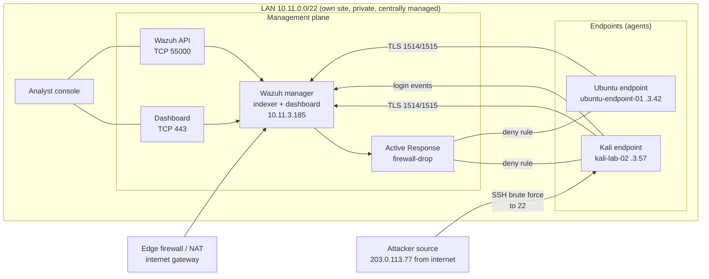

# Network Topology Implementation Report

**Author:** Kyrell Green
**Date:** 2026-09-17
**Module:** Network Security — SOC Security Analyst track
**Configuration covered:** **LAN** (Local Area Network)
**Lab environment:** AI-Agentic SOC Home Lab — macOS host (UTM virtualization) running the Wazuh
4.14.7 stack (manager/indexer/dashboard, Docker) and the monitored Linux endpoints; subnet
`10.11.0.0/22`
**Companion documents:** `Network Protocols and Architectures Report.md` (OSI/TCP-IP + subnetting),
`Firewall_IDS_IPS_Implementation_Report.md` (firewall/IDS/IPS on this LAN),
`Access Control Implementation Report.pdf`, `8-Week-SOC-Lab-Implementation-Plan.pdf` (design)

---

## Rubric Coverage

| Rubric requirement | Addressed in |
|---|---|
| A **network topology diagram** | Section 1 + 2 (Mermaid diagram of the implemented LAN + reference to the lab diagram image) |
| Cover **1 configuration** (LAN / WAN / MAN / PAN selected) | Section 1.1 — **LAN** chosen, defined, and justified against the rubric |
| Explanation of how the topology **supports secure communication** | Section 3 (segmentation, default-deny firewall, TLS agent channel, isolation) |
| Explanation of how the topology **supports network management** | Section 4 (single management plane, central logging, agent enrollment, diagnostics) |

---

## 1. Topology Configuration — LAN (chosen)

### 1.1 Configuration selected: LAN

The lab implements a **Local Area Network (LAN)**. A LAN is a network confined to a single site —
one building, room, or (here) one host + its virtual machines — where devices are connected by a
high-speed local medium and share the same broadcast domain unless segmented.

| Attribute | LAN (this configuration) |
|---|---|
| Geographic scope | Single location (one Mac host + UTM VMs + local network) |
| Ownership | Private — the lab operator owns the entire segment |
| Speed/latency | Low-latency, high-throughput (virtual switch / bridged NIC) |
| Administration | Single administrative domain — one lab console manages all devices |
| Example in this lab | The `10.11.0.0/22` network carrying all agent, manager, dashboard, and API traffic |

**Why a LAN is the correct choice for this lab (vs. WAN/MAN/PAN):** the rubric's alternatives
describe geographically wide or single-person networks. This SOC lab is a *single-site,
privately owned, centrally managed* deployment — exactly the LAN definition. The topology also
holds the security property the rubric asks about: as a private LAN it can enforce default-deny
controls at its own edge (Section 3) in a way a public WAN segment cannot.

### 1.2 Topology form: star (hub-and-spoke)

The implemented topology is a **star** — every monitored device connects to a central point:

- The **Wazuh manager** is the hub for all monitoring traffic.
- The **endpoints** (agents) are the spokes.
- The **analyst** reaches the same hub for visibility and control.

Star is deliberate: one failure domain to protect, one place to enforce policy, and one point of
observation — exactly what a SOC's monitoring plane needs.

---

## 2. Network Topology Diagram

### 2.1 Diagram of the implemented lab LAN

*Referenced diagram image:* `Network Protocols and Architectures.png` in this folder is the
physical/visual diagram of the same lab (host NICs, virtual switch, UTM VMs, and the wired
connections). The Mermaid diagram above is the logical/security view.

### 2.2 Topology inventory

| Node | Role | Address | Connection to the LAN |
|---|---|---|---|
| Wazuh manager (indexer + dashboard) | Central monitoring hub | `10.11.3.185` | LAN — receives all agent traffic; serves dashboard/API |
| Kali endpoint (`kali-lab-02`) | Monitored server, Wazuh agent `011` | `10.11.3.57` | LAN over TLS (agent channel) |
| Ubuntu endpoint (`ubuntu-endpoint-01`) | Monitored server, Wazuh agent | `10.11.3.42` | LAN over TLS (agent channel) |
| Analyst console | Human access point | local | LAN — dashboard (`443`) + API (`55000`) |
| Edge firewall / NAT | Internet boundary | LAN gateway | Only \(\geq\)7 alert email + outbound; controlled exposure |

---

## 3. How This Topology Supports Secure Communication

The star LAN is not just an inventory drawing — every security property the lab relies on is a
**consequence of the topology**:

| Security property | How the topology delivers it |
|---|---|
| **Single management plane** | All endpoints talk only to the manager (star hub). There is one place to enforce policy, one choke point to monitor, and one endpoint set to keep patched |
| **Default-deny edge** | Because the LAN is a single controlled segment, the firewall can scope every port to `10.11.0.0/22` — agent (1514/1515) and API (55000) traffic is refused from any source outside the LAN (`ufw allow from 10.11.0.0/22 ... ; ufw deny 1514,1515,55000/tcp`) — the firewall/IDS/IPS report §2 |
| **Encrypted agent channel** | Every spoke→hub flow is TLS (Wazuh agent↔manager). An attacker who taps the LAN still cannot read logs or FIM events in transit |
| **Central observation point** | All alerts converge at the hub, so a single analytic view (rule `100010`, MITRE T1110) sees the whole LAN — correlation is only possible because traffic has a common destination |
| **Containment is addressable** | Active Response can push a firewall-drop to any spoke from the hub — the star makes *response* as easy as detection |
| **Host isolation** | Because endpoints are VMs on the UTM host, a compromised host can be disconnected at the virtual NIC level (hypervisor isolation) — a LAN-level containment option |

**Threats this topology mitigates:** lateral monitoring-plane exposure (management ports closed to
everything outside the LAN), eavesdropping on the agent channel (TLS), and broadcast-storm /
segmentation-related attack surface (small controlled LAN rather than a flat campus segment).

---

## 4. How This Topology Supports Network Management

| Management task | How the topology enables it |
|---|---|
| **Fleet visibility** | One agents view lists every enrolled endpoint and its connection status (`agent deployed.png`) — impossible to maintain if devices were spread across WAN/MAN segments |
| **Centralized logging & search** | All endpoints ship to the single indexer; one query answers "what else hit this host?" — the search/forensics back-end of the SOC |
| **Single configuration point** | Rules (`local_rules.xml`), notification settings, and Active Response policy live in one manager — consistent enforcement without per-device drift |
| **Agent enrollment** | A spoke joins the star with one enrolment command; the manager's agent list is the management record of the fleet |
| **Diagnostics** | Connectivity checks against LAN addresses (`Ping.png`) confirm monitoring continuity; management node status is the health metric of the whole lab |
| **Scalable administration** | Adding an endpoint is "deploy agent, it appears in the star" — no new trust domains, no new routing |

**Operational concept:** the star LAN turns network management into *hub management*. The SOC
manages endpoints through the manager, and manages the manager at a single console — which is
why agent health, rule tuning, and alert review are all one-screen activities in this lab.

---

## Document Map (deliverable checklist)

| Rubric requirement | Location |
|---|---|
| Network topology diagram | §2 (Mermaid logical diagram + reference to the lab diagram image) |
| One configuration covered (LAN chosen) | §1.1 (LAN defined + justified vs. WAN/MAN/PAN) |
| How the topology supports secure communication | §3 (property-by-property table incl. firewall + TLS + segmentation) |
| How the topology supports network management | §4 (fleet, logging, config, diagnostics) |