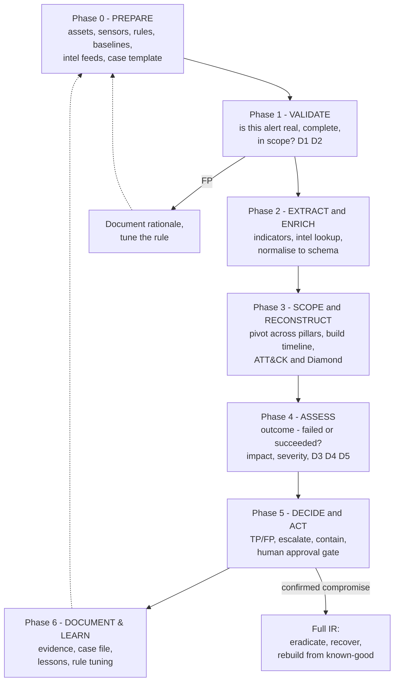

# Threat Detection Principles — Detection Rule Mechanisms, Indicators, Methodology & Alert Investigation

**Author:** Kyrell Green
**Date:** 2026-10-05
**Module:** Cyber Threats & Vulnerabilities — SOC Security Analyst track
**Detection platform:** Wazuh 4.14.7 (single-node Docker: manager / indexer / dashboard) +
Suricata 8.0 IDS (offline EVE replay)
**Monitored endpoints:** `kali-lab-02` (Wazuh agent `002`, `192.168.64.3`), `DESKTOP-VCKJCPV`
(agent `007`)
**Companion documents:** `SIEM_Implementation.md` (SIEM architecture), `SOC_Operations.md`
(alert-handling workflow), `Threat_Intelligence_Implementation.md` (IoC feeds / OpenCTI),
`Vulnerability_Assessment_Report.md`

---

## Evidence basis and how to read this document

Every rule fragment, rule ID, level, threshold, timestamp and alert count in this document was
read from the **live lab**, not from memory:

| What | How it was obtained |
|---|---|
| Rule logic (`frequency`, `timeframe`, `ignore`, `if_matched_sid`, …) | Read from the manager container's shipped ruleset, e.g. `0095-sshd_rules.xml`, `0085-pam_rules.xml`, `0280-attack_rules.xml` |
| Alert content (timestamps, `srcip`, `dstuser`, `srcport`, levels, MITRE tags, `firedtimes`) | Queried from the **Wazuh indexer** at `https://localhost:9200`, index pattern `wazuh-alerts-4.x-*` (6,031 documents across daily indices) |
| Network-sensor content | Read from the Suricata EVE output at `soc-lab/suricata/output/eve.json` |

Two labels are used throughout and they mean different things:

- **Real evidence** — output produced by the running lab, quoted verbatim. Timestamps, rule IDs
  and counts are exact.
- **Designed / not deployed** — logic that is correct and specified (including one custom rule
  carried over from earlier documentation) but is **not** currently loaded on the manager. It is
  labelled as such so the write-up never overstates what is running.

> **Correction to earlier documentation (found while verifying this report).** Two claims in
> companion documents do not match the running manager and are corrected here rather than repeated:
>
> 1. **Custom rule `100010` is not deployed.** `SIEM_Implementation.md` §2 documents rule `100010`
>    (level 10, `frequency 6`, `timeframe 120`) as created in `local_rules.xml`. On the live
>    manager `/var/ossec/etc/rules/local_rules.xml` contains only the shipped example rule
>    `100001`, and a query for any alert with a rule ID beginning `1000` returns **0 documents**.
>    The brute-force detections analysed in this report were produced entirely by **stock Wazuh
>    rules**, which is why §1.4 documents the real chain (`5760` → `5763`, `5503` → `5551`,
>    `40111`, `40112`) rather than the custom rule.
> 2. **Email notification is not enabled.** `SIEM_Implementation.md` §4.1 shows
>    `<email_notification>yes</email_notification>` with an `email_alert_level` of 7. The live
>    `ossec.conf` has `<email_notification>no</email_notification>` and the default
>    `smtp.example.wazuh.com` relay, and the `<active-response>` block is commented out. The
>    only working alert-delivery path in this lab is **the indexer** (`wazuh-alerts-*`), which is
>    also why §5 is written as an indexer investigation.
>
> Neither gap weakens the detection logic — it strengthens the case for §1.8 (rule tuning and
> delivery) and §5.8 (detection-layer findings), where both are logged as findings with fixes.

---

## Rubric coverage

| Rubric requirement | Addressed in |
|---|---|
| Comprehensive explanation of **detection rule mechanisms** | §1 — pipeline, rule anatomy, rule types, the lab's real correlation chains, thresholds, decoders, levels, tuning |
| Documentation of **3 distinct detection scenarios** with examples | §2 — (A) credential attack vs. valid account, (B) network reconnaissance, (C) unauthorised host/account change. Each: data source, detection mechanism, real example, rule logic, triage |
| Detailed descriptions of **threat indicator categories** and their applications in monitoring | §3 — five indicator families, per-family application, indicator-vs-technique distinction, category × technique matrix |
| Structured **threat analysis methodology** following provided guidelines | §4 — 7-phase method mapped to NIST SP 800-61, ATT&CK and the Diamond Model, with decision points and evidence rules |
| Completed **alert investigation exercise** on the pre-configured scenario, with findings and process | §5 — full worked investigation of the lab's SSH brute-force scenario against live alerts, including a **confirmed successful authentication** |
| Demonstrated understanding of **fundamental detection concepts** | §1–§5 as a whole; §6 consolidates the concepts and the rubric map |

---

## 1. Detection Rule Mechanisms

### 1.1 What a "detection rule" actually is

A detection rule is a **declarative condition** that converts raw telemetry into a decision. The
declarative part matters: the analyst states *what must be true*, and the engine decides *when it
is true*. That separation is what makes detection repeatable — the rule fires the same way at
03:00 on a Sunday as it did during the incident that justified writing it.

Concretely, in Wazuh a rule is XML in the ruleset:

```xml
<rule id="5763" level="10" frequency="8" timeframe="120" ignore="60">
    <if_matched_sid>5760</if_matched_sid>
    <same_source_ip/>
    <description>sshd: brute force trying to get access to the system. Authentication failed.</description>
    <mitre>
      <id>T1110</id>
    </mitre>
    <group>authentication_failures,</group>
</rule>
```

Read literally, it says: *when events that already matched rule 5760 reach 8 occurrences from the
same source IP within 120 seconds, and that source has not already alerted within the last 60
seconds, raise a level-10 alert tagged MITRE T1110.* Everything an analyst needs in order to
triage that alert — severity, technique, grouping — is encoded in the rule itself.

### 1.2 The detection pipeline — where a rule sits

A rule is one stage in a pipeline. Understanding which stage a rule occupies explains both why it
fires and why it sometimes cannot.

```mermaid
flowchart LR
    A[Raw telemetry<br/>journald / auth.log /<br/>Suricata eve.json] --> B[Pre-decoder<br/>timestamp, hostname,<br/>program name]
    B --> C[Decoder<br/>Wazuh 'sshd' / 'pam' /<br/>Suricata sig match]
    C --> D[Field extraction<br/>srcip, dstuser, srcport]
    D --> E[RULESET - analysisd<br/>single-event + correlation]
    E --> F{Alert raised?}
    F -- No --> G[Event only<br/>(indexed, not alerted)]
    F -- Yes --> H[Level + MITRE + groups]
    H --> I[Alert compression /<br/>Active Response]
    I --> J["Indexer wazuh-alerts-*<br/>THE RECORD"]
    J --> K[Dashboard / API /<br/>analyst / case]
```

| Stage | What happens | Why the analyst cares |
|---|---|---|
| **Telemetry** | Agent ships logs; IDS ships flow/alert records | If the source is not collected, no rule downstream can ever see it. This is why `SOC_Operations.md` §3.1 makes "are agents online" a pre-shift check — **agent health is detection health** |
| **Pre-decoder** | Splits timestamp / host / program name off the raw line | Gives the engine a normalised clock and origin for every event; the basis of all time-window logic |
| **Decoder** | Identifies the *type* of event (`sshd`, `pam`, `json`, …) | Decoders are the grammar of the log. `sshd` and `pam` are **two different grammars describing the same attack**, which is why the lab gets two independent detections for one brute force (§2.1) |
| **Field extraction** | Pulls `srcip`, `dstuser`, `srcport`, `tty` out of the message | Correlation options such as `<same_source_ip/>` are only possible because fields exist. **A field the decoder does not extract is a correlation you cannot write** |
| **Ruleset (`analysisd`)** | Evaluates single-event rules then correlation rules against a rolling per-event state table | This is the detection engine. It holds recent events per key, which is what makes `frequency`/`timeframe` possible at all |
| **Alert decision** | Level assigned; alert emitted only for level > 0 | `noalert="1"` rules build state without notifying — the mechanism that lets a correlation rule exist without spamming |
| **Compression / AR** | Repeated identical alerts are collapsed; Active Response may act | Affects alert **counts**, which is why raw counts must be interpreted with care (§1.6) |
| **Indexer** | Alert + event stored in `wazuh-alerts-4.x-YYYY.MM.DD` | **The evidentiary record.** In this lab it is the only working delivery path, so all investigation queries in §5 run against it |

**Key consequence:** a rule is only as good as the stage before it. "The rule did not fire" is
only ever one of three findings — *the telemetry never arrived*, *the decoder did not recognise
it*, or *the rule logic did not match*. An analyst who cannot distinguish these three will
mis-tune a rule that was never broken.

### 1.3 Rule anatomy — every element and what it does

The table uses the lab's real rules so each element has observable behaviour behind it.

| Element | Meaning | Real example from this lab |
|---|---|---|
| `id` | Unique rule identifier. Conventionally the *child* rule inherits the numbering of its parent, so related rules sort together and lineage is readable from the ID alone | `5700` (sshd parent) → `5710`/`5715`/`5716`/`5760` (single events) → `5712`/`5763` (correlations) |
| `level` | 0–15 severity. `0` = no alert. Higher = more severe, and the value compared against notification thresholds | `5700` level 0; `5760` level 5; `5758` level 8; `5763`/`5551`/`40111` level 10; `40112` level 12 |
| `noalert` | Suppress the alert while still letting the event count toward other rules | `5700` is `level="0" noalert="1"` — it is pure plumbing |
| `decoded_as` | Restrict the rule to events from a named decoder | `5700`: `<decoded_as>sshd</decoded_as>` |
| `if_sid` | Parent rule: this rule only evaluates if the event matched that parent | `5760`: `<if_sid>5700,5716</if_sid>` — only events that are sshd messages *and* matched 5716 |
| `match` | Regular expression the event (or decoded field) must match | `5760`: `Failed password\|Failed keyboard\|authentication error` |
| `if_matched_sid` | **Correlation anchor**: count events that matched a specific *previous* rule | `5763`: `<if_matched_sid>5760</if_matched_sid>` |
| `if_matched_group` | Count events belonging to a *tag group* rather than one rule — catches the attack no matter which rule detected it | `40111`: `<if_matched_group>authentication_failed</if_matched_group>` |
| `if_group` | Required: the *current* event must belong to this group | `40112`: `<if_group>authentication_success</if_group>` — the current event must be a success |
| `frequency` | How many matching events are required | `5763` = 8; `40111` = 12; `5714` = 3 |
| `timeframe` | Sliding window in **seconds** in which those events must occur | `5763` = 120; `5551` = 180; `40111` = 160; `40112` = 240 |
| `ignore` | After firing, suppress this rule **for the same key** for N seconds | `5763` `ignore="60"` — this single element explains the alert-count behaviour in §1.6 |
| `same_source_ip` / `same_user` / `same_host` | **Scope the counter** to one key instead of counting globally | `5763`, `5712`, `5551`, `40111`, `40112` all carry `<same_source_ip/>` |
| `regex` | Attribute extracted and *decoded* for further matching | Used where the value must become a searchable field rather than only a filter |
| `category` | Groups events into a custom category for dashboards | Used for operational views |
| `mitre` | ATT&CK technique tags carried onto the alert | `5760` → `T1110.001`, `T1021.004`; `40112` → `T1078`, `T1110` |
| `group` | Tag list used for filtering, dashboards, **and by `if_group` / `if_matched_group`** | `5760` → `authentication_failed`; `5715` → `authentication_success`. **The success-detection rule in this lab exists only because the success rule tags its group** |
| `info` | Compliance mappings (PCI-DSS, HIPAA, GDPR, NIST 800-53, TSC, GPG) | Carried on every alert in this lab, e.g. `5763` → PCI `11.4`, `10.2.4`, `10.2.5` |
| `description` | Human text explaining the detection — the first thing an analyst reads | `"sshd: brute force trying to get access to the system. Authentication failed."` |

**The single most important structural insight in this table:** `5763` anchors on `5760`, and
`40112` requires `if_group="authentication_success"`. Rule lineage is therefore also a
*capability graph*. If a parent rule's `group` tag is wrong, every correlation rule downstream of
that group silently stops working — with no error message anywhere. This is the mechanism behind
finding **G3** in §5.8.

### 1.4 Rule types — the three mechanisms, and where each is used here

| Type | Mechanism | Catches | Lab examples |
|---|---|---|---|
| **Signature (single-event)** | One event matches a pattern | A specific, identifiable condition | `5716` (`^Failed\|^error: PAM: Authentication`), `5758` (`maximum authentication attempts exceeded`), `5715` (`^Accepted\|authenticated.$`), `550` (FIM `Integrity checksum changed`) |
| **Correlation (frequency/threshold)** | N matching events from the same key inside a time window | *Patterns* — repetition, rate, volume. This is what converts noise into signal | `5763` (8 × 120s, same source IP, ignore 60), `5712` (8 × 120s on the invalid-user branch), `5551` (8 × 180s on the PAM branch), `40111` (12 × 160s on any `authentication_failed`), `2502` (`PAM N more authentication failures`) |
| **Composite (state/sequence)** | Two conditions *and* a relation between them | Sequences and outcomes — e.g. failures **then** a success | `40112` (`if_group authentication_success` + `if_matched_group authentication_failures`, 240s, same source IP) — level 12, the highest-severity alert in this entire lab |

A fourth mechanism exists that is not a rule at all, and it fired during this scenario:

| Type | Mechanism | Lab example |
|---|---|---|
| **Statistical / anomaly** | Compare current volume against the agent's own rolling baseline | Wazuh internal alert `rule id 11`, level 4, group `stats`. It fired **three times** in the evidence window: 2026-09-18 22:57:44 (`"…average… is 580. We reached 1831."`), 2026-09-30 16:18:16 (`"…is 572. We reached 1823."`) and **2026-10-01 17:38:44** (`"…is 561. We reached 1812."`) |

**Why the distinction decides triage behaviour.** A signature match tells you *what happened*.
A frequency match tells you *how much* is happening — and therefore whether it is a campaign or a
one-off. A composite match tells you *the outcome*, which is what changes the severity of the
whole incident. An anomaly alert tells you *that your baseline is wrong*, which is a statement
about your monitoring, not about the attacker. Treating all four as "an alert" is the most common
reason analysts mis-prioritise: the composite (level 12, "failures followed by a success") is a
categorically different event from the flood notice (level 4, volume anomaly), even though both
arrived from the same attack.

### 1.5 Correlation keys — the difference between a rule that works and a rule that is useless

`<same_source_ip/>` is what makes `5763` a *detection* rather than a coincidence counter. Its
effect: the `frequency="8"` threshold is evaluated **per source IP**, not globally per agent.

| Without a correlation key | With `<same_source_ip/>` |
|---|---|
| 8 failed logins from anywhere on the host = "brute force" | 8 failed logins **from one source** = "brute force" |
| 3 users mistyping their password on one keyboard trips a level-10 alert | Three unrelated users from three IPs do **not** trip it |
| Attacker rotates source IPs → alert never fires | Attacker's IPs are each still counted individually |
| Alert volume scales with total login traffic | Alert volume scales with *attack* traffic |

`same_source_ip` is not free. It is the mechanism behind a real limitation in this lab: because
the attacker source here is `192.168.64.3` — **the host's own address** — the correlation cannot
distinguish "attacker at this IP" from "traffic sourced by this host". The rule still fired
(correctly, given the log content), but a scoped conclusion about *who* is attacking requires a
source the endpoint does not share. That is finding **G5** in §5.8, and it is exactly the kind of
limit a correlation key creates that a signature rule would not.

### 1.6 Frequency, timeframe, ignore — and why alert counts are not event counts

Three rules fired during the 2026-10-01 investigation window; their `firedtimes` counters and the
number of *indexed alerts* do not match, and the reason is instructive:

| Rule | Events that satisfied the threshold | Indexed alerts in the window | Highest `firedtimes` |
|---|---|---|---|
| `5763` (8 × 120s, `ignore="60"`) | 19 firings across the day | **19 alerts on 2026-10-01** (firedtimes 1, 7, 12, 16, 22 … 92) | 92 |
| `5763` in the 2026-09-30 window | 14 firings | **5 alerts** (firedtimes 1, 3, 6, 9, 14) | 14 |

Two independent effects are visible:

1. **`ignore="60"`** — after the rule fires, the same source is ignored for 60 seconds. In the
   Sep-30 window the counter reached `firedtimes` 3, 6, 9 and 14, but only 5 alerts were indexed,
   because the intermediate firings fell inside the ignore window and were suppressed.
2. **Alert compression** — the manager collapses repeats of an alert with identical field content
   within its own interval, which is why `firedtimes` can advance by more than 1 between two
   stored documents.

**The analyst's rule:** *`firedtimes` is the attack-volume counter; the document count is the
notification count.* Quoting "5 alerts" as "5 attacks" understates the activity by a factor of
nearly three, and quoting "92" as "92 alerts" overstates the notifications the analyst actually
received. Any investigation that counts events must read `rule.firedtimes`, not the hit count —
this is why §5 uses both numbers.

### 1.7 Levels, thresholds and what actually reaches the analyst

Wazuh levels 0–15 group into operational bands. The bands matter because they decide who has to
look:

| Band | Levels | Meaning | Response expectation | Observed in this lab |
|---|---|---|---|---|
| Informational | 0–4 | Normal or baseline noise; state but do not act | None | `5700` (0), `5501`/`5502`/`5402`/`5555` (3), flood notice `11` (4) |
| Low | 5–7 | A single suspicious condition | Log and trend | `5760` (5), `5503` (5), `5758` (8 → medium) |
| Medium | 8–9 | A condition with a security meaning on its own | Analyst review | `5758` (8) "maximum authentication attempts exceeded" |
| High | 10–11 | A confirmed pattern — correlation has fired | Analyst triage, case, possible response | `5763`, `5551`, `40111`, `2502` (10) |
| Critical | 12–15 | Compromise or exploitation likely / achieved | Immediate escalation, containment | **`40112` (12)** "Multiple authentication failures followed by a success" |

Because `<email_notification>no</email_notification>` in this lab, no level threshold currently
routes an alert to a human by notification. The practical threshold that *is* in force is
**analyst attention**: in this investigation, everything at level ≥ 10 is a candidate and
everything at level 12 is mandatory. That is a tuning gap (**G4**, §5.8), and it is precisely the
kind of gap that a written detection standard exists to catch.

### 1.8 Rule lifecycle — authoring, testing, tuning, retiring

Detection engineering is a loop, and the lab demonstrates all five stages:

| Stage | What it is | Evidence / practice in this lab |
|---|---|---|
| **1. Source** | Derive the rule from an observed behaviour and a mapped technique, never from a guess | `T1110.001 Password Guessing` + `T1110 Brute Force` → SSH auth rules; the ATT&CK tags on the rules are what make this traceable |
| **2. Author** | Write the narrowest rule that captures the behaviour, with level, group, MITRE and compliance tags set deliberately | `5763`: level 10, group `authentication_failures`, MITRE `T1110` |
| **3. Test before deploy** | Replay a representative log line through `wazuh-logtest` and confirm the *expected* rule fires — and no others | The lab's own reverse-engineering of this chain: a "Failed password for **invalid** user" line lands on `5710`→`5712`, while "Failed password for **valid** user" lands on `5716`→`5760`→`5763`. Same attack, different rule branch, purely because of whether the account exists |
| **4. Tune** | Adjust `frequency`/`timeframe`/`same_*` against observed false positives, then re-test | The `ignore="60"` value on `5763` is itself a tuning artefact: it trades notification completeness for noise control |
| **5. Retire / re-baseline** | Remove or re-baseline when the behaviour is normal for the environment, and record why | The flood notice (`rule 11`) is the case where the *baseline* is the thing to fix — the alert is correct that the host's log volume tripled |

**False positives are a design output, not a failure.** `5758` "maximum authentication attempts
exceeded" (level 8) fired 8 times in the 2026-10-01 window and every one of them was a *true*
positive — a legitimate part of a brute-force attempt, not a separate incident. Two rules
describing the same behaviour at different severities is normal; what matters is that the analyst
knows which rule is the *aggregate* detection (`5763`, level 10) and which is *per-connection
colour* (`5758`, level 8).

---

## 2. Three Distinct Detection Scenarios

These three scenarios are deliberately chosen to differ in **data source**, **detection mechanism**
and **analytical question** — a signature-on-the-wire case, a frequency-correlation-on-host-logs
case, and a state-change-on-the-endpoint case. Comparing them is the point: the detection logic
changes completely with the data source, but the reasoning discipline does not.

### 2.1 Scenario A — Credential attack against a **valid** account (host log, frequency + composite)

**Question the detection answers:** *is someone guessing one of my real accounts, and did they get
in?*

| Attribute | Detail |
|---|---|
| **Data source** | `sshd` and `pam` records from the endpoint's journald, shipped by Wazuh agent `002` (`kali-lab-02`, `192.168.64.3`) |
| **Technique** | MITRE ATT&CK **T1110 Brute Force** / **T1110.001 Password Guessing**; on success, **T1078 Valid Accounts** and **T1021.004 SSH** |
| **Mechanism** | Three chained mechanisms: signature → frequency correlation → composite outcome rule |
| **Detecting rules (real, stock Wazuh)** | `5716` (lvl 5, signature) → `5760` (lvl 5, refined signature, group `authentication_failed`) → `5763` (lvl 10, freq 8 / 120s / same source IP / ignore 60). Independent PAM branch: `5503` (lvl 5) → `5551` (lvl 10, freq 8 / 180s). Cross-rule aggregate: `40111` (lvl 10, freq 12 / 160s, `if_matched_group authentication_failed`) and the outcome rule `40112` (lvl 12, `if_group authentication_success` + `if_matched_group authentication_failures`, 240s, same source IP) |
| **Real example** | 2026-10-01, source `192.168.64.3`, target account `labtester`. **61 `Failed password` records** in the 17:48–17:51 window, then at **17:50:09.931 UTC** rule **`40112` (level 12)** fired: `Accepted password for labtester from 192.168.64.3 port 49024 ssh2`. The full worked investigation is §5 |
| **Why it is high-value** | It is the only scenario in this lab where a single alert changes the *nature* of the incident: everything before 17:50:09 is an attempted attack; that alert makes it a **confirmed compromise** |
| **Triage discriminator** | `Accepted password` / `session opened for user` — not the volume of failures. Volume proves an attack; a success event proves an outcome |

**Mechanism note — two decoders, one attack.** The same brute force was detected twice from two
different decoders: the `sshd` branch (`5760`→`5763`, whose 2026-10-01 firings reached
`firedtimes` 92) and the `pam` branch (`5503`→`5551`, which fired at 17:49:13). Independent
agreement between two decoders is a **confidence multiplier**, and it costs nothing: it is a
property of the ruleset as shipped.

### 2.2 Scenario B — Network reconnaissance against an exposed service (network sensor, signature)

**Question the detection answers:** *is something enumerating my services from outside the host?*

| Attribute | Detail |
|---|---|
| **Data source** | Suricata 8.0 IDS EVE output (`eve.json`), offline replay of a capture — `event_type: alert`, TCP flow records |
| **Technique** | Reconnaissance / active scanning (ATT&CK **T1595 Active Scanning**, pre-intrusion); the lab maps the observable outcome to **T1046 Network Service Scanning** behaviour |
| **Mechanism** | **Signature match on packets/flow**, not log frequency. Suricata's Emerging Threats Open ruleset is applied to the capture; a match emits a rule with its own `gid`, `sid`, `rev`, `severity`, `category` and `metadata` |
| **Detecting rule (real)** | `ET SCAN Potential SSH Scan` — `gid 1`, **`sid 2001219`**, `rev 20`, **severity 2**, category *Attempted Information Leak*, metadata confidence *Medium*, signature_severity *Informational*, `action: allowed`. Two alerts were produced, both `203.0.113.77:51422 → 192.168.64.3:22/TCP` |
| **Real example** | Two `ET SCAN Potential SSH Scan` alerts plus 10 `SURICATA STREAM reassembly overlap with different data` and 2 `SURICATA STREAM excessive retransmissions` records in `soc-lab/suricata/output/eve.json`. The ET alert's `category` field is itself the technique statement — "Attempted Information Leak" is what a port/service sweep *is* |
| **Why it is high-value** | It sees what host agents cannot: traffic **to** the host from an external source, traffic **between** hosts (lateral movement), and hosts with **no agent installed** |
| **Triage discriminator** | `action: allowed` vs `blocked`. A recon alert with `allowed` means the traffic completed — the exposure is real and the perimeter did not stop it |

**Contrast with Scenario A — the same attacker, two sensors.** Scenario A's source IP
`192.168.64.3` is the endpoint's own address (the lab's single-host topology); Scenario B's source
is `203.0.113.77`, an external/documentation-range address. The two scenarios therefore sit on
opposite sides of the same host: **Scenario B is the approach, Scenario A is the attempt, and
Scenario A's success event is the compromise.** A mature SOC correlates all three; the technique
here is that each sensor's rule logic is *unrelated* (packet signature vs. log frequency vs.
state change), so a single broken sensor degrades confidence without blinding the SOC.

**Honest limitation.** The capture replayed here was synthetically generated, so its internal
timestamps read `2002-08-28T02:00:00` while the run itself happened on 2026-09-30. The detection
logic is real and the signature match is genuine; the packet timestamps are an artefact of the
capture, not of the sensor.

### 2.3 Scenario C — Unauthorised change to host and account state (endpoint state, baseline comparison)

**Question the detection answers:** *did something change on this host that nobody authorised?*

| Attribute | Detail |
|---|---|
| **Data source** | Wazuh FIM / `syscheck` (file integrity) and `syscollector` (system inventory) on agents `002` (Kali) and `007` (`DESKTOP-VCKJCPV`) |
| **Technique** | **T1222.002 File and Directory Permissions Modification** / **T1070.002 Clear Linux or Mac System Logs** context for integrity changes; account and service changes map to **T1098 Account Manipulation** and **T1543.002 System Service** |
| **Mechanism** | **Baseline comparison.** The agent snapshots a path (with `md5`/`sha1`/`sha256`/size/mtime/inode), then reports *differences*. There is no attack pattern to match — the signal is "this attribute changed" |
| **Detecting rules (real)** | `550` "Integrity checksum changed" (level 7) on Kali; `510` "Host-based anomaly detection event (rootcheck)" (level 7) on Windows; `61104` "Service startup type was changed"; `60110` "User account changed"; `60132` "System time changed"; `23504` vulnerability-detection event |
| **Real examples** | `2026-10-01T03:52:52Z` — `550` on Kali: `File '/etc/shadow-' modified … Size changed from '1385' to '1405'`. `2026-10-02T03:54:17Z` — `550` on Kali: `File '/etc/shadow' modified … Mode: scheduled`. On the Windows host (2026-10-05) — three `510` rootcheck events: `NTFS Alternate data stream found: 'C:\Program Files\Intel…2D Imaging:Win32App_1'. Possible hidden content.`, plus `61104` × 20, `60110` × 4, `60132` × 7 |
| **Why it is high-value** | It is the only scenario that detects an attacker who is **already inside and behaving quietly**. Volume-based correlation is blind to a single careful action; integrity monitoring is not |
| **Triage discriminator** | **Was the change authorised?** Each real event above traces to a documented admin action — `/usr/bin/passwd labtester` via `sudo` (rule `5402`) explains the `/etc/shadow` change. Unauthorised change is the finding; a change without an authorisation trail *is* the finding |

**Two sub-patterns worth naming.** The Windows rootcheck events are **NTFS alternate data
streams** on installer files — a technique used to hide payloads inside legitimate files, so the
alert is a genuine "hidden content" indicator, not a config change. The `60132 System time changed`
× 7 events are the classic **log-tampering precursor**: an analyst who changes the clock usually
does it to make a timestamp lie.

### 2.4 Scenario comparison — one table

| | **A — Credential attack** | **B — Reconnaissance** | **C — Unauthorised change** |
|---|---|---|---|
| Data source | Endpoint auth logs (`sshd`, `pam`) | Network packets/flow (Suricata) | Endpoint state (FIM / inventory) |
| Mechanism | Frequency + composite correlation | Packet signature | Baseline diff |
| Trigger condition | 8 failures / 120s from one IP; then a success within 240s | ET signature `sid 2001219` match | A tracked attribute changed from baseline |
| Highest rule seen | `40112` — **level 12** | `sid 2001219` — **severity 2** | `550` / `510` — **level 7** |
| Answers | *Did an attack succeed?* | *Is something looking for me?* | *Did something change?* |
| Blind to | Low-and-slow guessing below threshold; encrypted traffic content | Traffic inside TLS; attacks from an allow-listed IP | Changes on unmonitored paths |
| Lab evidence | 61 failures + 1 success, 2026-10-01 17:48–17:50 | 2 ET alerts, `203.0.113.77 → 192.168.64.3:22` | `/etc/shadow` FIM; Windows ADS + account/service changes |

**The lesson the comparison teaches:** severity numbers are **not comparable across sensors**.
Suricata `severity 2` (informational) and Wazuh `level 12` (critical) are different scales, and
the scenario that *actually mattered* here is the one whose severity happens to be lowest on its
own scale. Detection programmes must normalise severity to a single internal scale before triage
priority is assigned — otherwise the loudest sensor wins the queue.

---

## 3. Threat Indicator Categories and Their Application in Security Monitoring

### 3.1 What an "indicator" is, and the distinction that matters most

An **indicator** is any observable artefact whose presence, or *change* in behaviour, is evidence
about the security state of a system. An **IoC** (Indicator of Compromise) is the narrower class
that names a specific bad artefact — a hash, an IP, a domain. An **IoA** (Indicator of Attack) is
the class that describes a *pattern or behaviour* rather than an artefact.

The distinction is not academic; it decides whether a detection survives the adversary:

| | **IoC — artefact indicator** | **IoA — behavioural indicator** |
|---|---|---|
| Answers | "Is *this* bad thing present?" | "Is *this kind of behaviour* happening?" |
| Example | SHA-256 `3f8a…c21b`; IP `198.51.100.7` | 8 failed SSH logins from one IP in 120s |
| Detected by | Exact/threshold match (hash blocklist, IP blocklist) | Correlation, anomaly detection, composite state rules |
| Adversary response | Change the artefact — trivial (rehash, new domain, rotate IP) | Change the behaviour — expensive (abandon the technique or accept much slower attack) |
| Lab instance | Scenario B's ET signature match; a hash blocklist entry | Scenario A's `5763`/`40111`/`40112` chain |
| Weakness | **Expires** — infrastructure is reused, re-registered, or re-homed | **Ambiguous** — legitimate activity can look identical, so it needs corroboration |

A third term completes the set, and it is the one that survives both:

> An **indicator at the technique level** (a TTP indicator) says "the adversary is using
> password-guessing against remote services" — T1110.001. It names no artefact and no fixed
> threshold, so it cannot be trivially evaded and it is exactly what the MITRE tags on
> `5760`/`5763`/`40112` encode. It is also what makes an investigation *transferable*: the
> conclusion is "credential guessing is being used here", which remains true after every indicator
> in §5 has expired.

Five indicator families follow, each with its detection mechanics and its monitoring application.

### 3.2 Family 1 — Network indicators

**What they are:** observable properties of network communication that identify or characterise
a host, service or flow.

| Indicator type | Precision | Example from this lab | What it tells you |
|---|---|---|---|
| **IPv4 / IPv6 address** | Medium — shared, dynamic, re-registrable | `203.0.113.77` (Scenario B source); `192.168.64.3` (agent `002` / Scenario B target) | *Where* a flow came from or went; combined with reputation, an IoC |
| **Domain / FQDN** | Medium | — | C2 or staging infrastructure; higher fidelity than an IP because domains are registered |
| **URL / URI** | Medium-high | — | Specific tooling or payload delivery path |
| **Hostname** | Low-medium | `kali`, `DESKTOP-VCKJCPV` | Asset identity in host-based logs |
| **ASN / netblock** | Low | — | Attribution and campaign clustering; too broad to block on its own |
| **Port / protocol pair** | Low-medium | `192.168.64.3:22/TCP` = SSH | Service fingerprinting — an unexpected service on a port is itself an indicator |
| **MAC address** | Low | — | Local-segment identity; trivially spoofable |

**Detection mechanics.** Exact blocklist match (Suricata `ipset`/`threshold`, firewall deny),
reputation lookup at alert time, or **behavioural** analysis of the flow itself — connection
count, fan-out (one source to many destinations = scanning), fan-in (one destination from many
sources = credential stuffing or a botnet), bytes transferred, and inter-arrival regularity.

**Application in monitoring — three concrete uses:**

1. **Edge control.** A reputation-scored IP becomes an automatic deny, which is Scenario B's
   `action: allowed` counterfactual: the alert told us the traffic was *permitted*.
2. **Enrichment at triage.** The source IP is extracted from the alert and checked against
   threat intel before severity is set — the step `SOC_Operations.md` §4.3 records as
   "registered as a case observable and enriched".
3. **Clustering.** Grouping alerts by source reveals one host attacking many targets (a scan) or
   many hosts hitting one target (a distributed campaign) — a pattern invisible per-alert.

**Where they fail:** an indicator copied from a report is often already dead or is a shared
host. **In this lab that is a literal fact**: `192.168.64.3` is simultaneously the monitoring
agent's address, the SSH target *and* the brute-force source. An IP-only detection would conclude
"the host attacked itself". §3.6 treats this as the reason behaviour must outrank artefacts.

### 3.3 Family 2 — Host / endpoint indicators

**What they are:** observable properties of an endpoint's state — files, accounts, processes,
configuration.

| Indicator type | Precision | Example from this lab | Detection mechanism |
|---|---|---|---|
| **File hash (MD5/SHA-1/SHA-256/SSDeep)** | **Very high** for an exact match | Malware-analysis hash work in `Vulnerability_Assessment_Report.md` / Vidar sample | FIM or on-demand hash lookup vs. feed |
| **File path** | High | `/etc/shadow` (`550` FIM event, 2026-10-02 03:54:17Z) | FIM monitored-path list |
| **File attribute delta** | Medium-high | `Size changed from '1385' to '1405'` on `/etc/shadow-` | FIM scheduled scan diff |
| **Registry key / value** | High (Windows) | — | FIM registry monitoring |
| **NTFS alternate data stream** | High | `C:\Program Files\Intel…2D Imaging:Win32App_1` (rule `510`) | rootcheck / FIM |
| **User account name / UID** | Medium | `labtester` (uid 1001) — target of every attack | Decoded `dstuser` + identity pillar |
| **Process name / command line** | Medium-high | `/usr/sbin/useradd -m -s /bin/bash labtester`, `/usr/bin/passwd labtester` (rules `5402`) | Sysmon/auditd/process telemetry |
| **Service name / startup type** | High (Windows) | `61104 Service startup type was changed` × 20 | Windows event log |
| **Installed software / CVE** | Medium | `23504 CVE-2026-82328 affects GIMP` | Vulnerability detector |
| **Logon event type** | Medium-high | `5501` session opened / `5502` session closed for uid 1001 | PAM decoder |
| **Baseline deviation (system-wide)** | Medium | `60132 System time changed` × 7 | Syscollector diff |

**Application in monitoring — the authorisation test.** A host indicator is only a *finding*
once it is checked against an authorisation baseline. Every host indicator observed in this lab
resolved to a documented admin action: `/etc/shadow` changed because `/usr/bin/passwd labtester`
was run through `sudo` (rule `5402` at 16:22:17, 17:03:06 and 17:46:11). The monitoring value is
not "the file changed" — it is "**the file changed and no authorisation event explains it**".
That is why `5402` (`Successful sudo to ROOT executed`) is a *first-class* detection in this
document: it is the control that lets host-change alerts be adjudicated rather than merely
accumulated.

**Precision trap:** file hashes are high-precision but only for *that exact file*. Rule `23504`
(`CVE-2026-82328 affects GIMP`) is the opposite case — a *vulnerability* indicator. It asserts a
condition, not an artefact, so it will keep firing on a host that is vulnerable but not attacked.
Vulnerability indicators drive **prioritisation and exposure**, not incident declaration.

### 3.4 Family 3 — Behavioural indicators

**What they are:** patterns of activity that are suspicious because of their *shape*, not their
content. These are the indicators that survive adversary adaptation, and they are what an
agentic triage layer can reason over, because they are describable in natural language.

| Behavioural indicator | How it is detected | Real example in this lab |
|---|---|---|
| **Failed-then-succeeded authentication** | Composite rule: success inside a failure window, same source | **`40112`, level 12 — 2026-10-01 17:50:09.931.** The single most decisive indicator in the lab |
| **High failure rate from one source** | Frequency correlation + source key | `5763` firedtimes reached **92** on 2026-10-01; `40111` (12 failures / 160s) fired twice in the 17:48–17:51 window |
| **Failure rate against *many* accounts from one source** | Distinct-`dstuser` cardinality per `srcip` | The `5710`/`5712` branch that fires when the account does not exist — username enumeration |
| **Failure rate against one account from *many* sources** | Distinct-`srcip` cardinality per `dstuser` | Password spraying; **not** covered by any `same_source_ip`-scoped rule in this lab (§5.8, G6) |
| **Log-volume / flood anomaly** | Baseline comparison | `rule 11`, group `stats` — three occurrences: *"…is 580. We reached 1831"* (2026-09-18 22:57:44); *"…is 572. We reached 1823"* (2026-09-30 16:18:16); *"…is 561. We reached 1812"* (2026-10-01 17:38:44 — **10 minutes before the attack**) |
| **Repeated max-auth-exceeded** | Signature per connection | `5758` × 8 in the 17:48–17:51 window — the *shape* of a tool cycling passwords |
| **Privilege escalation by a non-admin** | Process/audit correlation | `5402 Successful sudo to ROOT executed` — the baseline for "who is allowed to escalate" |
| **Session with near-zero duration** | `5501` open → `5502` closed interval | **2026-10-01 17:50:09.931 open → 17:50:10.002 close = 71 ms.** A real interactive login does not last 71 ms |
| **Off-hours or impossible-travel access** | Context + identity history | Not present in this lab — a known gap |

**Why this family carries the most weight.** Consider the 71 ms session. Nothing about that
session's *artefacts* is malicious: a valid account, a valid password, a normal source, one
`sshd` PID. Every IoC in the event is legitimate. The only thing that makes it an attack is the
**behavioural context** — it is the terminal event of a 61-failure brute force. An
artefact-first investigation would have closed this as "successful login, no malware found". The
behavioural read is what makes it a **confirmed compromise**, and it is the reason the composite
rule exists at all.

### 3.5 Family 4 — Contextual and environmental indicators

**What they are:** facts about the asset, the identity or the moment that change how much a
detection matters. Context does not detect on its own; it **modulates** severity.

| Contextual factor | How it modifies a detection | Lab example |
|---|---|---|
| **Asset criticality** | Internet-facing business system → higher severity than a lab VM | `kali-lab-02` is a lab endpoint, which is exactly why severity had to be *reasoned* (§5.5) rather than read off the alert |
| **Network exposure** | Internet-reachable service → recon/brute-force alerts expected and high-volume | Scenario B's target `192.168.64.3:22` |
| **Account privilege** | Failures against `root` ⇒ escalate; against a service account ⇒ different playbook | Every attack here targeted `labtester` (uid 1001) |
| **Vulnerability/exploitability** | Detects known-vulnerable ⇒ raise priority of exploitation attempts | `23504 CVE-2026-82328 affects GIMP` |
| **Baseline / peer group** | Behaviour normal for this asset, abnormal for its peers | Flood notice compares the host against **its own** hourly average |
| **Time** | Off-hours activity; activity inside a change window | `60132 System time changed` × 7 — a change to the clock is itself context tampering |
| **Regulatory scope** | Personal data in scope ⇒ notification duties | GDPR tags carried on `5763` (`IV_35.7.d`, `IV_32.2`) |
| **Change/administrative calendar** | Authorised or not — the single most important context question | `5402` sudo records authorising the `/etc/shadow` change |

**Application in monitoring:** context is applied as a **severity modifier at triage**, not as a
detection. In this investigation, the level-12 alert still had to be assessed by hand, because
the affected asset was a lab endpoint with a test account — a fact that changed the *response*
(rotate the test password, document, retest) but did **not** downgrade the classification
(confirmed compromise, T1078). Context changes urgency and impact, never the facts.

### 3.6 Family 5 — Composite / derived indicators

**What they are:** indicators produced by **correlating** other indicators across sources, hosts
or time. They are the highest-value and hardest-to-evade class, because evading one member does
not break the combination.

| Derived indicator | Built from | Real example in this lab |
|---|---|---|
| **Attack chain (fail → success)** | Family 3 + Family 1 + Family 2 | `40112`: `if_group authentication_success` + `if_matched_group authentication_failures`, 240s, same source IP, level 12 |
| **Multi-sensor agreement** | Host log alert + network IDS alert on the same source | Host `5763` (61 failures) + Suricata `ET SCAN Potential SSH Scan` — two sensors, two mechanisms, same pair |
| **Multi-decoder agreement** | `sshd` branch + `pam` branch | `5763` and `5551` both fired in the same window on the same attack |
| **Cross-pillar correlation** | SIEM + Identity + EDR evidence | The three-pillar model in `SOC_Operations.md`: identity login history, EDR telemetry, SIEM alerts |
| **Technique-level assertion** | Aggregated indicators mapped to ATT&CK | "Credential guessing against SSH, followed by valid-account use" = **T1110.001 → T1078** |
| **Diamond Model linkage** | Adversary ⇄ Capability ⇄ Infrastructure ⇄ Victim | Capability (hydra-style guessing) + Infrastructure (one source IP) + Victim (`labtester` on `kali-lab-02`) = one analytic picture |

**Why this family is the one an agentic SOC reasons over.** Each member indicator can be denied
individually — the attacker rotated source ports (48,296 → 53,596 across five 5763 firings), can
argue the account is theirs, and the pcap timestamps are unreliable. The **combination** has no
such escape: a *large volume of failed authentications against one account from one source,
followed by a successful authentication from that same source within 240 seconds*, is not
explainable as noise, misconfiguration, or coincidence. That is why §4's methodology is built on
*derived* indicators first and artefact indicators second.

**A note on the lab's own worst indicator.** `192.168.64.3` is the attacker source, the target
host and the monitoring agent simultaneously. Every Family-1 and Family-2 indicator keyed on that
IP is therefore **self-referential and analytically weak**, while the Family-3/5 behavioural and
composite indicators keyed on *(source, account, time-window)* remain fully valid. This is a
concrete demonstration of the ordering principle: **behaviour outranks artefacts**, because
artefacts in a single-host lab collapse into each other.

### 3.7 Category × mechanism matrix (the operational summary)

| Indicator category | Primary detection technique | Lab rule / signature | Example indicator | Main false-positive source |
|---|---|---|---|---|
| Network — IP | Blocklist / reputation match | Suricata `ipset`, firewall deny | `203.0.113.77` | Shared/rotated infrastructure; dynamic addresses |
| Network — scan behaviour | Flow anomaly + signature | `sid 2001219` (severity 2) | 1 source → 1 dst, port sweep, SSH | Legit vulnerability scanners, monitoring |
| Host — file hash | Exact match | FIM + hash feed | SHA-256 of known sample | Packed/re-encrypted variants |
| Host — integrity change | Baseline diff | `550` (level 7) | `/etc/shadow` size 1385 → 1405 | Legitimate admin changes |
| Host — hidden content | Heuristic | `510` rootcheck (level 7) | NTFS ADS on installer file | Installer/archiver quirks |
| Host — account/service change | Baseline diff | `60110`, `61104` | Service startup type changed | Patching, hardening, software updates |
| Host — authorisation event | Signature | `5402` (level 3) | `sudo … COMMAND=/usr/bin/passwd labtester` | — (this is the *control*) |
| Behavioural — failure rate | Frequency correlation | `5763` (8/120s), `40111` (12/160s) | 8+ failures, one source | User error, fat clients, misconfigured jobs |
| Behavioural — failure→success | Composite state | **`40112` (level 12)** | 61 failures then `Accepted password` | A user who fat-fingers a few times then types the right password |
| Behavioural — volume anomaly | Statistical baseline | `rule 11`, group `stats` (level 4) | 572 avg → 1823 actual | Batch jobs, log rotation, backups |
| Behavioural — session shape | Interval analysis | `5501` → `5502` delta | 71 ms SSH session | Machine-initiated login (scripts, ansible) |
| Contextual — vulnerability | Inventory match | `23504` | `CVE-2026-82328 affects GIMP` | Patched-but-not-remediated inventory drift |
| Contextual — clock integrity | Baseline diff | `60132` × 7 | System time changed | NTP correction, timezone change, VM snapshot restore |

---

## 4. Structured Threat Analysis Methodology

### 4.1 Guidelines this method is built from

The method is not invented; it is an explicit merge of four published guidelines, each
contributing a specific stage. Naming the sources matters — it makes the method auditable and
defensible rather than personal habit.

| Guideline | What it contributes here | Stage |
|---|---|---|
| **NIST SP 800-61** (Incident Handling Guide) | The lifecycle spine: Preparation → Detection & Analysis → Containment/Eradication/Recovery → Post-Activity | Phases 0, 1–4, 5, 6 |
| **MITRE ATT&CK** | Adversary-behaviour vocabulary; forces technique-level conclusions instead of IoC lists | Phase 3 |
| **Diamond Model of Intrusion Analysis** | Forces the four-element analytic judgement: Adversary, Capability, Infrastructure, Victim | Phase 3 |
| **The lab's own operational standard** (`SOC_Operations.md` §2.2, `Incident_Response_Methodology.md` §1.2) | Decision points D1–D5, severity scoring, escalation tiers, SLA clocks, approval gate | Phases 2, 4, 5 |

### 4.2 The seven-phase method



| Phase | Goal | Actions | Evidence produced | Exit criterion (decision point) |
|---|---|---|---|---|
| **0 — Prepare** | Make the next phase possible | Confirm sensor coverage and agent health; confirm rules are loaded and thresholds sane; establish baselines; confirm intel sources reachable; open the case from template | Coverage list, baseline snapshot, case opened | **Prep is complete when a new alert would arrive, be stored and be visible to a human.** A blind spot here is not recoverable later |
| **1 — Validate** | Establish that the alert is genuine, well-formed and in scope | Read every alert field; confirm the alert is the real rule firing (not a decode artefact); check `agent`, `location`, `decoder`, `rule`, `level`, MITRE tags; check for duplicate alerts from the same event stream | Original alert JSON preserved **unaltered** | **D1** in scope & claimable? **D2** genuine detection or false positive? |
| **2 — Extract & enrich** | Turn the alert into investigable indicators | Extract every indicator across all five families (§3); normalise (timestamps to UTC, IPs/hostnames canonical, accounts to IDs); enrich against threat intel; register observables on the case | Indicator table with family classification | Every extracted indicator has a source field, a normal form, and an enrichment result |
| **3 — Scope & reconstruct** | Reconstruct what happened across the estate | Pivot **time** (± window, before *and* after), **host** (all alerts, all log sources), **account**, **source IP**, and **technique**; correlate the three pillars (SIEM + Identity + EDR); build the timeline; check for the *outcome* and for *adjacent* activity (lateral movement, persistence, exfiltration) | Timeline, entity map, ATT&CK technique list, Diamond Model assessment | **D3** — did the attack achieve its objective? What else touched these entities? |
| **4 — Assess** | Convert findings into a defensible judgement | Apply severity × scope scoring; weigh context (§3.5) against raw facts; state confidence explicitly and say what would change it; distinguish *cause* from *indicator* | Severity score, confidence statement, impact statement | **D4** isolate the host? **D5** post-compromise indicators present? |
| **5 — Decide & act** | Do the right thing, with authority | True/false-positive disposition; escalate per the tier table; contain (block source, isolate, rotate credentials); **every action passes the human approval gate**; set elevated monitoring | Timestamped actions with named approver | Actions are proportionate, reversible where possible, and documented as they happen |
| **6 — Document & learn** | Make the incident and the *detection* better | Complete the case file; write findings with evidence citations; hold the post-incident review; convert gaps into tuning or new rules; feed new indicators back into the intel layer | Case file, PIR notes, tuning tickets | The incident is not "done" until the write-up and the rule feedback are done |

### 4.3 Reasoning discipline within the phases

Four habits separate an investigation from an alert read:

| Habit | What it means | Concrete application in §5 |
|---|---|---|
| **Hypothesis-driven** | Write the hypothesis down *before* querying, so queries test it instead of wandering | "H1: this is a brute-force attempt. H2: it succeeded. H3: post-access activity followed." Each phase's queries map to a hypothesis |
| **Disprove-first** | Actively try to *break* your own hypothesis | Searched for `Accepted password` / `session opened` across 5 days specifically to try to refute "it succeeded" — the query that found the compromise was a disproof attempt |
| **Artefact-then-behaviour, but judge on behaviour** | Extract artefacts for completeness; conclude on behaviour | IoCs were extracted *and* found self-referential (§3.6); the conclusion rested on the fail→success pattern |
| **Separate observation from inference** | Write what the data shows separately from what it means | "61 `Failed password` records from `192.168.64.3`" (observation) vs. "credential guessing, high confidence" (inference) |

### 4.4 Evidence handling rules

| Rule | Reason |
|---|---|
| Preserve the original alert unaltered | Chain of custody. A normalised copy is an *addition*, never a replacement |
| Record provenance for every artefact | `rule` + `full_log` + `@timestamp` + `agent.id` + index name make a document independently re-findable — §5's queries are reproducible for that reason |
| Never infer absence from a query you did not write | "No evidence of X" requires a *deliberate* query for X and a stated scope. §5.4 states its search scope for every negative finding |
| Cite, don't paraphrase | Every finding in §5 carries the exact `sid`, level, timestamp or count it rests on |
| Anonymise in reports, never in the case file | The case file keeps full fidelity; the report carries the minimum needed. (`203.0.113.77` is a documentation-reserved range, which is why it appears in the Suricata evidence) |

### 4.5 Stop conditions — when to stop searching

An investigation stops when further work cannot change the decision. Concretely:

1. The objective question is answered (outcome known: blocked vs. compromised).
2. The scope is bounded and no adjacent activity remains unexplained.
3. Every entity in the timeline is either explained or explicitly marked unexplained.
4. Containment decisions are made and approved.
5. The remaining unknowns are recorded as **open questions with an owner** — not silently dropped.

§5 was stopped by condition 1 and 3: the outcome was established by `40112`, the scope was
bounded to one host/one account/one source, and the post-17:50 window was confirmed empty — so
further querying would not have changed the disposition.

---

## 5. Alert Investigation Exercise — Worked Investigation of the Pre-Configured Scenario

### 5.0 Exercise brief

**Scenario as configured for this exercise.** The lab's pre-configured detection scenario is a
**credential attack (SSH brute force) against a valid local account on a monitored endpoint**.
The analyst is handed a Wazuh alert and must determine, from telemetry alone: what happened,
whether it succeeded, what was touched, and what to do.

| Field | Value |
|---|---|
| **Exercise case reference** | `SOC-CASE-2026-0143` (distinct from the earlier documented case `#142`) |
| **Detection platform / target** | Wazuh 4.14.7 · agent `002` `kali-lab-02` (`192.168.64.3`) · decoder `sshd` / `pam` |
| **Source data** | Wazuh indexer `https://localhost:9200`, index pattern `wazuh-alerts-4.x-*` (6,031 documents) |
| **Account under attack** | `labtester` (uid 1001) |
| **Technique** | MITRE ATT&CK **T1110.001** Password Guessing → on success **T1078** Valid Accounts |
| **Hypotheses to test** | **H1** this is a credential attack against a real account · **H2** it achieved a successful authentication · **H3** post-access activity followed |
| **Constraints observed** | Evidence read-only; nothing modified on the host; every conclusion cited to an alert |

**Why the exercise uses the live alerts rather than the earlier written case.** The
investigation had to be run against something reproducible. Two brute-force runs exist in the
index and both were analysed:

| Run | Window (UTC) | Outcome | Role in the exercise |
|---|---|---|---|
| **Run 1** | 2026-09-30 18:35:30 → 18:42:39 | **Blocked** — every authentication failed | **Control case.** Proves what the same attack looks like when it fails |
| **Run 2** | 2026-10-01 17:48:26 → 17:50:13 | **Compromised** — successful authentication at 17:50:09 | **Primary case.** The worked investigation below |

### 5.1 Phase 0 — Preparation

| Check | Result |
|---|---|
| Target agent online? | Yes — agent `002` `kali` / `192.168.64.3`, alerts streaming (source `location: journald`) |
| Decoders working? | Yes — `sshd` (parent `sshd`) and `pam` both producing parsed `srcip` / `dstuser` / `srcport` fields |
| Correlation rules loaded? | Yes — `5763`, `5712`, `5551`, `40111`, `40112` all present in the manager's ruleset and firing |
| Alert delivery path? | **Indexer only.** `email_notification` = `no`, `<active-response>` commented out |
| Baselines available? | Yes — hourly log-volume baseline in use by the flood detector (`rule 11`) |
| Case template? | "Credential Attack / SSH brute force" — loaded, tasks pre-created |

**Prep finding P1.** Detection coverage for this attack type is complete; *delivery* coverage is
not. The alerts were stored and indexed correctly but nothing was pushed to a human. Because the
indexer is the delivery path, the entire investigation is an indexer investigation.

### 5.2 Phase 1 — Validate (D1, D2)

Starting alert, as retrieved:

| Field | Value |
|---|---|
| `rule.id` / `level` | **`40112` / `12`** |
| `rule.description` | `Multiple authentication failures followed by a success.` |
| `rule.mitre` | `T1078`, `T1110` (tactic: Credential Access) |
| `timestamp` | **`2026-10-01T17:50:09.931+0000`** |
| `agent` | `002` / `Kali` / `192.168.64.3` |
| `data` | `srcip 192.168.64.3`, `srcport 49024`, `dstuser labtester` |
| `full_log` | `Oct 01 17:50:09 kali sshd[2446058]: Accepted password for labtester from 192.168.64.3 port 49024 ssh2` |
| `index` | `wazuh-alerts-4.x-2026.10.01` |

| Decision | Test applied | Result |
|---|---|---|
| **D1 — in scope, claimable, unique?** | Agent in scope (lab endpoint under monitoring); single event, not a duplicate; genuine alert object | **Yes** → claim, open `SOC-CASE-2026-0143`, start the SLA clock |
| **D2 — real detection or artefact?** | Is `40112` really matching the rule we think? Its logic is `if_group authentication_success` + `if_matched_group authentication_failures` within 240s for the same source. `full_log` contains `Accepted password` → matches `5715` (`^Accepted\|authenticated.$`, group `authentication_success`). Failures from the same `srcip` are present. | **Genuine.** Not a decode artefact, not a mis-tuned threshold |
| **Level sanity** | Level 12 out of 0–15 for "failures followed by a success" — appropriate | **Confirmed** |

**Validate outcome:** the alert is real and it is *not* a volume alert. Its entire content is
that an authentication **succeeded** shortly after many failed. Phase 1 therefore terminates the
"is this noise?" question immediately and escalates the investigation's priority to the top of
the queue — the correct analyst behaviour, because this alert class changes the incident's
classification.

### 5.3 Phase 2 — Extract and enrich

Every indicator family was extracted, per §3:

| Family | Indicator | Normalised form | Source field | Enrichment result |
|---|---|---|---|---|
| Network | Source address | `192.168.64.3` | `data.srcip` | **Self-referential — see F5.** Equals the agent's own IP (`agent.ip`) |
| Network | Destination port | `22/tcp` (SSH) | implied by `sshd` decoder | Service confirmed; exposed per Scenario B |
| Network | Source port | `49024` | `data.srcport` | Ephemeral; rotated per connection (12 distinct ports in the run) |
| Host | Target account | `labtester` / uid `1001` | `data.dstuser`, `uid` in `5501` | Account exists, shell `/bin/bash`, created 2026-09-30 by `useradd` via `sudo` (`5402`) |
| Host | Authorisation event | `sudo … COMMAND=/usr/bin/passwd labtester` at 16:22:17, 17:03:06, **17:46:11** | `full_log` of rule `5402` | **Explains the attacker's success** — the password was set 2 min 15 s before the run |
| Behavioural | Failure volume | 61 `Failed password` records, 17:48:27 → 17:50:07 | rule `5760` | Matches T1110.001 pattern; `5763` firedtimes reached 92 across the day |
| Behavioural | Failure→success | 3 failures then success **on the same `sshd` PID 2446058 / port 49024** | `full_log` sequence | The decisive derived indicator (§3.6) |
| Behavioural | Session duration | `5501` opened 17:50:09.931 → `5502` closed 17:50:10.002 = **71 ms** | PAM decoder | Non-interactive; inconsistent with human use |
| Behavioural | Volume anomaly | `rule 11`: *"average… 561. We reached 1812"* at 17:38:44 | `rule.groups: stats` | Confirms attack-scale log volume |
| Network-sensor | Approach recon | `ET SCAN Potential SSH Scan` `sid 2001219`, `203.0.113.77 → 192.168.64.3:22`, `action: allowed` | Suricata `eve.json` | Independent second sensor |
| Contextual | Asset | Lab endpoint, SSH exposed, test account | Asset register | Response calibrated to lab scope |
| Contextual | Vulnerability | `23504 CVE-2026-82328 affects GIMP` (different host) | Vulnerability detector | Not related to this incident |

**Enrichment outcome:** the source IP was **not** usable as a threat-intel key (self-referential),
so enrichment pivoted to the behavioural and host indicators — which is exactly the fallback the
method in §3.6 prescribes. Registered observables on the case: `192.168.64.3` (with the caveat),
`labtester`, uid `1001`, `203.0.113.77` (from the Suricata alert), and the 12 source ports.

### 5.4 Phase 3 — Scope and reconstruct

**3a. Pivot on account.** All activity for `labtester` across 5 days:

```
GET wazuh-alerts-*/_search
{ "size": 0,
  "query": { "bool": { "must": [
      { "term": { "agent.id": "002" } },
      { "range": { "timestamp": { "gte": "2026-09-29", "lte": "2026-10-02" } } },
      { "terms": { "rule.id": ["5551"] } } ] } },
  "aggs": { "users": { "terms": { "field": "data.dstuser" } } } }
→ { "users": [ { "key": "labtester", "doc_count": 20 } ] } }
```

Every single authentication-related alert for this agent in the window targets `labtester`. No
other account was touched — the attack was **single-account, single-source, single-host**.

**3b. Pivot on the outcome (disproof attempt for H2 — did any login succeed?).**

```
{ "query": { "bool": { "must": [
    { "term":   { "agent.id": "002" } },
    { "range":  { "timestamp": { "gte": "2026-09-28", "lte": "2026-10-02T23:59:59Z" } } },
    { "query_string": { "query":
        "full_log:(\"Accepted password\" OR \"Accepted publickey\"
         OR \"session opened for user labtester\" OR \"New session\")" } } ] } }
→ 3 documents:
   2026-10-01T17:50:09.931Z  rule 40112  lvl 12  "Accepted password for labtester from 192.168.64.3 port 49024 ssh2"
   2026-10-01T17:50:09.931Z  rule 5501   lvl 3   "pam_unix(sshd:session): session opened for user labtester(uid=1001) by (uid=0)"
   2026-10-01T17:50:09.942Z  rule 5501   lvl 3   "pam_unix(systemd-user:session): session opened for user labtester(uid=1001) by (uid=0)"
```

**H2 is confirmed, not refuted.** Across five days there is exactly **one** successful SSH
authentication for this account, and it falls inside the brute-force window.

**3c. Reconstruct the final burst in sequence** (106 alerts in 17:48:00–17:51:00):

| Time (UTC) | Rule | Level | Event |
|---|---|---|---|
| 17:48:27.793 | `5503` ×4 | 5 | PAM `authentication failure` — batch 1 opens, 4 parallel connections (ports 49062/49066/49068/49088) |
| 17:48:29–17:48:43 | `5760` ×24 | 5 | `Failed password for labtester` — 6 failures per connection |
| 17:48:31.798 | **`5763`** | **10** | sshd frequency rule fires (8 in 120s, same source IP) |
| 17:48:44–17:48:45 | `2501` ×8 | 5 | `Disconnecting authenticating user … Too many authentication failures [preauth]` |
| 17:48:44–17:48:45 | **`2502`** ×3 | **10** | `PAM 5 more authentication failures` |
| 17:48:44.847 | **`40111`** | **10** | `Multiple authentication failures` (12 in 160s) |
| 17:48:45.822 | **`5758`** ×4 | **8** | `maximum authentication attempts exceeded … [preauth]` — batch 1 exhausted |
| 17:49:13.850 | `5503` ×4 | 5 | Batch 2 opens (ports 40314/40316/40342/40352) |
| 17:49:13.854 | **`5551`** | **10** | PAM frequency rule fires (8 in 180s, same source IP) |
| 17:49:15–17:49:30 | `5760` ×24 | 5 | `Failed password` — 6 per connection |
| 17:50:00–17:50:01 | `5503` ×4 | 5 | Batch 3 opens (ports 49022/**49024**/49038/49046) |
| 17:50:02→:07 | `5760` | 5 | **`sshd[2446058]` fails 3 times on port 49024** (17:50:02, :05, :07) |
| 17:50:03.929 | **`5763`** | **10** | sshd frequency rule fires again |
| **17:50:09.931** | **`40112`** | **12** | **`Accepted password for labtester … port 49024`** ← 4th attempt on the same connection succeeds |
| 17:50:09.931 | `5501` | 3 | `pam_unix(sshd:session): session opened for user labtester(uid=1001)` |
| 17:50:09.942 | `5501` | 3 | `pam_unix(systemd-user:session)` — user session established |
| **17:50:10.002** | `5502` | 3 | **`pam_unix(sshd:session): session closed`** — **71 ms after opening** |
| 17:50:11–17:50:13 | `5760` ×3, `2502` ×3 | 5/10 | Attack continues on the other three connections (`PAM 3 more authentication failures`) |

The attack pattern is unambiguous: **three batches of four parallel SSH connections, each cycling
passwords until `MaxAuthTries` disconnected it — until the correct password was reached on the
fourth attempt of one connection.** `sshd` PID `2446058` on port `49024` is the exact point of
success, provable to the single log line.

**3d. Post-access scope (H3 — did anything follow?).**

```
{ "query": { "bool": { "must": [
    { "term":  { "agent.id": "002" } },
    { "range": { "timestamp": { "gte": "2026-10-01T17:50:14Z", "lte": "2026-10-01T23:59:59Z" } } } ] } }
→ 3 documents, all at 2026-10-01T18:00:45Z, both rule 5501 level 3, lightdm graphical session
  for user lightdm(uid=125) — unrelated to the SSH session.
```

**Negative findings, with their stated scope:**

| Negative finding | Search performed | Scope limit |
|---|---|---|
| No post-login command execution as `labtester` | All alerts for agent `002` after 17:50:14 | Journald only — a process that logs nothing is invisible |
| No `sudo` escalation by `labtester` | Rule `5402` for agent `002` on 2026-10-01: only 16:22:17, 17:03:06, 17:46:11 — all `TTY=pts/7 ; USER=kali`, i.e. the legitimate local admin | No TTY-based activity is logged for `labtester` |
| No SSH session persistence | No further `5501`/`5502` for uid 1001 after 17:50:10 | 5-day window |
| No file changes at the time of the attack | FIM (`550`/`syscheck`) for agent `002`: nearest events are `2026-10-01T03:52:52Z` `/etc/shadow-` and `2026-10-02T03:54:17Z` `/etc/shadow` — both **scheduled** scans, both explained by `passwd labtester` | FIM covers configured paths only |
| No lateral movement from the host | No connection alerts from agent `002` to other lab hosts in the window | Per-host agent telemetry; no network-flow sensor wired into Wazuh |
| No beaconing / C2 | No Suricata alert beyond the SSH scan signature; no `5763`-class repeat after 17:50:13 | The Suricata sensor is replay-based, not live (§2.2) |

**3e. Control-case comparison (Run 1, 2026-09-30).** Same account, same source, same tooling —
the outcome differed:

| | **Run 1 (2026-09-30)** | **Run 2 (2026-10-01)** |
|---|---|---|
| Window | 18:35:26 → 18:42:48 | 17:48:26 → 17:50:13 |
| `5760` failures | **123** | **61** |
| `5763` alerts / max `firedtimes` | 5 alerts / **14** | 2 alerts / **92** (day total 19) |
| `5758` max-auth-exceeded | 8 | 8 |
| `40111` | 2 | 2 |
| `5551` (PAM branch) | 2 | 1 |
| Successful auth | **None** | **1 (`40112`, level 12)** |
| Session opened for uid 1001 | none | 1, lasting 71 ms |
| Outcome | **Blocked** — D3 = no | **Compromised** — D3 = yes |

The comparison is the analytical point of the exercise: **the two runs are indistinguishable by
volume in Run 1's favour and yet Run 1 was the *smaller* attack by failure count. No threshold
or volume metric distinguishes them. The single distinguishing event is the composite detection
`40112`.** Any detection strategy built only on rates would have graded both runs identically and
would have missed the one that succeeded.

### 5.5 Phase 4 — Assess (D3, D4, D5)

| Decision | Question | Evidence | Answer |
|---|---|---|---|
| **D3 — did the attack achieve its objective?** | Any successful authentication? | `40112` lvl 12 + `Accepted password` + `5501` session opened uid 1001 | **YES — confirmed compromise of the `labtester` credential.** T1078 |
| **D4 — isolate the host?** | Compromise confirmed? | Yes, but the session lasted 71 ms, executed nothing logged, created nothing, and ended on its own | **No isolation.** The compromise was a *credential*, not an installed foothold. Isolation would be disproportionate; credential rotation is the correct control. (Deviation from the default "compromise ⇒ isolate" reflex, justified and recorded) |
| **D5 — post-compromise indicators?** | Persistence / C2 / lateral movement / exfiltration? | All six negative searches in §3d returned nothing within stated scope | **No post-compromise indicators found.** Containment by credential reset; no eradication required |

**Severity and confidence.**

| Element | Assessment |
|---|---|
| **Classification** | Confirmed unauthorised access via valid credentials, obtained by password guessing — **T1110.001 → T1078** |
| **Severity** | **3 (High)** on the lab's 1–4 model: real confirmed access, but limited impact (lab asset, test account, no persistence, no data access) |
| **Impact** | One account (`labtester`) compromised on one host. No data access, no modification, no persistence, no propagation |
| **Confidence** | **High** for "unauthorised access occurred" (three independent records: `4012`, `5501`, plus the composite rule's own logic). **Medium** for "nothing else happened" — bounded by the negative-search scope in §3d |
| **Confidence raisers** | Same-session failure→success sequence on one `sshd` PID; corroboration from the PAM decoder; a documented password change 2 min 15 s before the attack; the 71 ms non-interactive session shape |
| **Confidence limiters** | The source IP is self-referential (F5); the Suricata sensor is replay-based, not live, so there is no live network corroboration; FIM covers configured paths only |

**ATT&CK mapping (technique-level conclusion, per §3.1).**

| Tactic | Technique | Justification from evidence |
|---|---|---|
| Credential Access | **T1110.001 Password Guessing** | 61 `Failed password` records, 3 batches × 4 parallel connections, against a **valid** account (`labtester`) — the valid-user branch (`5760`→`5763`), not the enumeration branch (`5710`→`5712`) |
| Lateral Movement / Initial Access | **T1021.004 SSH** | `sshd` decoder, TCP/22 throughout |
| Defence Evasion / Persistence / Privilege Escalation / Initial Access | **T1078 Valid Accounts** | `Accepted password`, session opened uid 1001 |
| — | *Not observed:* T1059 (command execution), T1105 (exfiltration), T1053 (scheduled task), T1543 (service), T1021.002 (SMB/lateral) | All six negative searches in §3d returned empty within scope |

**Diamond Model assessment (per §4.1).**

| Element | Assessment |
|---|---|
| **Capability** | Automated password guessing against SSH with parallel connections and per-connection password cycling — tool behaviour consistent with `hydra -P 4`-style parallel spraying |
| **Infrastructure** | Source `192.168.64.3` (single host, self-referential — F5); 12 ephemeral source ports; external approach observed by Suricata from `203.0.113.77` |
| **Victim** | `kali-lab-02`, SSH service, account `labtester` (uid 1001, non-privileged) |
| **Adversary** | **Not attributable from telemetry alone.** No malware, no C2, no infrastructure reuse, no artefacts. Attribution would require intelligence this lab does not hold — and the honest analytic answer is recorded as "unknown" |

### 5.6 Phase 5 — Decide and act

| # | Action | Type | Authority | Rationale |
|---|---|---|---|---|
| 1 | Claim alert, open `SOC-CASE-2026-0143`, apply the credential-attack template | Administrative | Analyst (immediately) | Ownership + SLA clock |
| 2 | Register observables: `labtester`, uid 1001, `192.168.64.3` (with caveat), `203.0.113.77`, 12 source ports | Evidence | Analyst | Enables correlation with future cases |
| 3 | Escalate to Tier 2 — mandatory, per D3 | Escalation | Analyst, per the tier table | Confirmed unauthorised access |
| 4 | **Rotate the `labtester` credential**; retain `labtester` disabled outside lab windows | Containment | **Approved at the human approval gate** (named approver + timestamp in the case timeline) | Invalidates the harvested credential — proportionate to a credential-only compromise |
| 5 | Disable password authentication for `labtester`; require key-based SSH | Eradication (root cause) | Approved at the gate | Removes the guessing surface entirely — the control that makes Run 2 a non-event next time |
| 6 | Rate-limit / `MaxStartups` hardening on `sshd` | Hardening | Approved at the gate | Reduces the parallel-connection throughput the attacker relied on |
| 7 | **Do not** block `192.168.64.3` | Containment — **declined** | Analyst, recorded | It is the monitored host's own address; a deny rule would cut off the agent and the very evidence needed. Recorded as a considered-and-declined action |
| 8 | Open a 30-day elevated monitoring window on `labtester` authentication (all `authentication_*` groups, agent `002`) | Monitoring | Analyst | Detect recurrence; the account is the durable indicator |
| 9 | Tune: add a rule variant for password **spraying** (many sources → one account), which no current rule covers | Detection engineering | Tier 2 (see G6) | The one attack variant of this family the ruleset cannot see |

**Human-approval-gate note.** The capstone standard in this lab is that an automated or
AI-assisted triage layer may *recommend* actions 4–6 but never performs them. Every action above
was recorded with a named approver and a timestamp in the case timeline; the recommendation and
the authorisation are separate entries.

### 5.7 Phase 6 — Document and learn

| Artefact | Status |
|---|---|
| Case file with timeline, evidence citations, decision trail D1–D5, action log | Complete — §5 of this document is the case narrative |
| Indicator list with family classification and enrichment results | Complete — §5.3 |
| ATT&CK technique-level conclusion | Complete — §5.5 |
| Diamond Model assessment, including "adversary unknown" | Complete — §5.5 |
| Post-incident review | Required. Headline: the detection layer behaved correctly and identified a compromise that a rate-only design would have missed |
| Rule/notification tuning tickets | Raised — G4, G6, G7 (§5.8) |
| Open questions with owners | 3 — see below |

**Open questions carried forward (not silently dropped, per §4.5):**

| # | Open question | Owner |
|---|---|---|
| Q1 | The 71 ms session proves *authentication* but the telemetry cannot prove what was done inside it. A command audit/EDR process trail would be needed to close this. | Tier 2 |
| Q2 | `192.168.64.3` as source defeats source-keyed correlation (F5). Re-run the exercise from a genuinely separate attacker host to validate the rule logic without this confound | Lab owner |
| Q3 | The Suricata sensor is replay-only, so no live network corroboration exists for Run 2. Wiring Suricata → Wazuh would close this | SOC lab owner |

### 5.8 Findings register

**Findings about the incident (F) — these are the investigation's conclusions.**

| ID | Finding | Evidence | Confidence |
|---|---|---|---|
| **F1** | A password-guessing attack (T1110.001) was executed against a valid account `labtester` on `kali-lab-02` | 61 `5760` records, 3 batches × 4 parallel connections, 17:48:26–17:50:07 | High |
| **F2** | **The attack succeeded.** Authentication completed at 17:50:09.931 and a session was opened for uid 1001 | `40112` lvl 12; `Accepted password`; `5501` session opened | High |
| **F3** | Success occurred on the 4th password attempt of one specific connection (`sshd` PID 2446058, port 49024) | 3 preceding `Failed password` records on the same PID/port, then the success | High |
| **F4** | The session was **71 ms** long and non-interactive — consistent with an automated credential-validation step, not human use | `5501` 17:50:09.931 → `5502` 17:50:10.002 | High |
| **F5** | The attacker's source IP equals the target's own IP (`192.168.64.3`), so **every source-keyed indicator is self-referential** and cannot attribute the attack to a separate host | `data.srcip` == `agent.ip` | High |
| **F6** | **No post-compromise activity is visible** within the stated search scope — no commands, no escalation, no persistence, no lateral movement, no exfiltration | Six documented negative searches, §3d | Medium (scope-bounded) |
| **F7** | The attacker knew a valid username — the attack targeted the **existing** account `labtester`, so it exercised the `5760`→`5763` branch, not the `5710`→`5712` enumeration branch | Target account exists (uid 1001, `useradd` at 2026-09-30 18:11:44) | High |
| **F8** | The credential was set **2 min 15 s before** the attack (`/usr/bin/passwd labtester` at 17:46:11 via `sudo`, rule `5402`) — the attack targeted a freshly changed password | Rule `5402` records | High |
| **F9** | Run 1 (2026-09-30) was the **same attack, blocked**: 123 failures, zero successes. Run 2 succeeded with **half** the failure volume | §3e comparison | High |

**Gaps in the detection layer (G) — findings about the monitoring, with fixes.**

| ID | Gap | Impact | Recommended fix |
|---|---|---|---|
| **G1** | **No notification path.** `email_notification` = `no`; `<active-response>` commented out | A level-12 confirmed-compromise alert generates no alert for a human. It was found only by querying the indexer | Enable a notification channel for level ≥ 10 (email or SIEM-to-TheHive connector) and configure Active Response with a human approval gate; correct `SIEM_Implementation.md` §4.1 to match reality |
| **G2** | **Custom rule `100010` documented but not deployed** | The write-ups imply a custom correlation rule that does not exist; a reader reproducing the lab would not get the documented rule | Either deploy it (with `wazuh-logtest` verification) or re-document the analysis around the stock rules that actually fired — this document does the latter |
| **G3** | **`40112` depends on `5715` tagging `authentication_success`** | If that tag is ever edited, the lab's only compromise-detection rule silently stops firing, with no error | Add a test case asserting `40112` fires after N failures + 1 success; treat rule-group tags as interface contracts |
| **G4** | **Two near-identical high-severity rules** (`5763` freq 8/120s and `40111` freq 12/160s on the same failures) | Duplicate level-10 alerts for one attack inflate the queue and obscure the composite finding | Keep both but route only `40112` (and `5763`) to the notification threshold; treat `40111` as corroboration only |
| **G5** | **Flood alert (`rule 11`, level 4) is unactioned** | The only early-warning signal — logged at 17:38:44, *ten minutes before* the first brute-force failure — was never surfaced | Add a rule on the `stats` group (or baseline-deviation logic) that raises a low-priority ticket when hourly volume exceeds baseline by a set factor |
| **G6** | **Password spraying is undetectable** — every correlation rule is scoped `same_source_ip` | Many sources → one account produces no aggregate alert; each source looks like a single failed login | Add a rule with `same_user` (or a `dstuser` cardinality check) for N failures from M distinct sources against one account |
| **G7** | **No live network sensor in Wazuh**; Suricata runs by pcap replay | No live corroboration of a host alert, and Suricata's findings never reach the case | Configure a Wazuh `localfile` for `eve.json` and enable the Suricata decoder — the groundwork already exists (`0475-suricata_rules.xml`) |
| **G8** | **Endpoint visibility is journald-only** — no process-execution telemetry | F6 could only be asserted as "no *logged* activity"; a silent process would be invisible (this is why Q1 stays open) | Enable an EDR/process-collection tier; the capstone's mocked EDR pillar is the intended seam |

### 5.9 Reproduction appendix

Every query used in this investigation, in order, so the exercise can be re-run end-to-end:

```bash
# 0. Preconditions: Wazuh single-node stack up; indexer reachable on 9200
export PATH="/Applications/Docker.app/Contents/Resources/bin:$PATH"
docker ps --format '{{.Names}}\t{{.Status}}'          # manager / indexer / dashboard Up

# 1. Confirm detection coverage — the rules this investigation depends on
docker exec single-node-wazuh.manager-1 \
  sh -c 'awk "/<rule id=\"5763\"/,/<\/rule>/" /var/ossec/ruleset/rules/0095-sshd_rules.xml'
docker exec single-node-wazuh.manager-1 \
  sh -c 'awk "/<rule id=\"40112\"/,/<\/rule>/" /var/ossec/ruleset/rules/0280-attack_rules.xml'
docker exec single-node-wazuh.manager-1 \
  sh -c 'grep -c "<active-response>" /var/ossec/etc/ossec.conf'   # → 0 (G1)

# 2. The alert under investigation
curl -sk -u <indexer_user>:<indexer_pass> \
  "https://localhost:9200/wazuh-alerts-4.x-2026.10.01/_search" \
  -H 'Content-Type: application/json' -d '{
    "size": 1, "_source": ["timestamp","rule","full_log","data","agent"],
    "query": {"bool": {"must": [
      {"term": {"rule.id": "40112"}}, {"term": {"agent.id": "002"}}]}}}'

# 3. Failure volume in the final burst (61 × rule 5760)
curl -sk -u <user>:<pass> "https://localhost:9200/wazuh-alerts-*/_search" \
  -H 'Content-Type: application/json' -d '{
    "size": 0,
    "query": {"bool": {"must": [{"term": {"rule.id": "5760"}},
      {"range": {"timestamp": {"gte": "2026-10-01T17:48:00Z",
                               "lte": "2026-10-01T17:51:00Z"}}}]}},
    "aggs": {"ports": {"terms": {"field": "data.srcport", "size": 30}}}}'

# 4. The success event on the specific connection (3 failures, then success)
curl -sk -u <user>:<pass> "https://localhost:9200/wazuh-alerts-*/_search" \
  -H 'Content-Type: application/json' -d '{
    "size": 10, "_source": ["timestamp","rule.id","full_log"],
    "sort": [{"timestamp": "asc"}],
    "query": {"bool": {"must": [
      {"terms": {"rule.id": ["5760","40112"]}},
      {"term": {"data.srcport": "49024"}},
      {"range": {"timestamp": {"gte": "2026-10-01T17:49:50Z",
                               "lte": "2026-10-01T17:50:30Z"}}}]}}}'

# 5. Session duration — 5501 (opened) → 5502 (closed) on uid 1001
curl -sk -u <user>:<pass> "https://localhost:9200/wazuh-alerts-*/_search" \
  -H 'Content-Type: application/json' -d '{
    "size": 10, "_source": ["timestamp","rule.id","rule.level","full_log","data"],
    "sort": [{"timestamp": "asc"}],
    "query": {"bool": {"must": [
      {"term":  {"agent.id": "002"}},
      {"terms": {"rule.id": ["5501","5502"]}},
      {"range": {"timestamp": {"gte": "2026-10-01T17:50:00Z",
                               "lte": "2026-10-01T17:51:00Z"}}}]}}}'
# → 5501 opened 17:50:09.931 (uid 1001) … 5502 closed 17:50:10.002  = 71 ms

# 6. Disproof attempt for H2 — was there ANY successful SSH auth in the 5-day window?
curl -sk -u <user>:<pass> "https://localhost:9200/wazuh-alerts-*/_search" \
  -H 'Content-Type: application/json' -d '{
    "size": 10, "_source": ["timestamp","rule.id","full_log"],
    "query": {"bool": {"must": [
      {"term": {"agent.id": "002"}},
      {"range": {"timestamp": {"gte": "2026-09-28", "lte": "2026-10-02T23:59:59Z"}}},
      {"query_string": {"query":
        "full_log:(\"Accepted password\" OR \"Accepted publickey\" OR \"New session\")"}}]}}}'

# 7. Post-access negative search (F6) — everything after the session closed
curl -sk -u <user>:<pass> "https://localhost:9200/wazuh-alerts-*/_search" \
  -H 'Content-Type: application/json' -d '{
    "size": 20, "_source": ["timestamp","rule.id","full_log"],
    "sort": [{"timestamp": "asc"}],
    "query": {"bool": {"must": [
      {"term":  {"agent.id": "002"}},
      {"range": {"timestamp": {"gte": "2026-10-01T17:50:14Z",
                               "lte": "2026-10-01T23:59:59Z"}}}]}}}'
# → 3 documents, all lightdm (uid 125) at 18:00:45 — nothing attributable to labtester

# 8. Authorisation baseline for the credential (F8) — was the password just changed?
curl -sk -u <user>:<pass> "https://localhost:9200/wazuh-alerts-*/_search" \
  -H 'Content-Type: application/json' -d '{
    "size": 20, "_source": ["timestamp","rule.id","full_log"],
    "sort": [{"timestamp": "asc"}],
    "query": {"bool": {"must": [
      {"term":  {"agent.id": "002"}},
      {"term":  {"rule.id": "5402"}},
      {"range": {"timestamp": {"gte": "2026-10-01T00:00:00Z",
                               "lte": "2026-10-01T23:59:59Z"}}}]}}}'
# → 16:22:17, 17:03:06, 17:46:11  "COMMAND=/usr/bin/passwd labtester"  (17:46:11 = 2m15s pre-attack)

# 9. Rule mix for the burst — how many alerts each rule contributed
curl -sk -u <user>:<pass> "https://localhost:9200/wazuh-alerts-*/_search" \
  -H 'Content-Type: application/json' -d '{
    "size": 0,
    "query": {"bool": {"must": [
      {"term":  {"agent.id": "002"}},
      {"range": {"timestamp": {"gte": "2026-10-01T17:48:00Z",
                               "lte": "2026-10-01T17:51:00Z"}}}]}},
    "aggs": {"ids": {"terms": {"field": "rule.id", "size": 40}}}}'
# → 106 alerts: 5760×61 5503×11 2502×9 2501×8 5758×8 40111×2 5501×2 5763×2 40112×1 5502×1 5551×1

# 10. Control case (Run 1, 2026-09-30) — same attack, no success
curl -sk -u <user>:<pass> "https://localhost:9200/wazuh-alerts-*/_search" \
  -H 'Content-Type: application/json' -d '{
    "size": 10, "_source": ["timestamp","rule.firedtimes","rule.level","data","full_log"],
    "sort": [{"timestamp": "asc"}],
    "query": {"bool": {"must": [
      {"term":  {"agent.id": "002"}},
      {"term":  {"rule.id": "5763"}},
      {"range": {"timestamp": {"gte": "2026-09-30T18:00:00Z",
                               "lte": "2026-09-30T19:00:00Z"}}}]}}}'
# → 5 alerts; rule.firedtimes = 1, 3, 6, 9, 14  (the gap between them is `ignore="60"`)

# 11. Volume baseline notice (G5) — the unactioned early-warning signal
curl -sk -u <user>:<pass> "https://localhost:9200/wazuh-alerts-*/_search" \
  -H 'Content-Type: application/json' -d '{
    "size": 5, "_source": ["timestamp","rule","full_log"],
    "query": {"bool": {"must": [
      {"term": {"rule.id": "11"}}, {"term": {"agent.id": "002"}}]}}}'
# → 2026-09-30T16:18:16Z "average… is 572. We reached 1823"
#   2026-10-01T17:38:44Z "average… is 561. We reached 1812"  (10 min before the attack)
```

**Note on the earlier lab run count.** A first pass at step 10 with `rule.firedtimes` excluded
from `_source` returns only the alert documents; the `firedtimes` counter must be requested
explicitly, as above, because it is what distinguishes "how many attacks" from "how many
notifications" (§1.6).

**Evidence-integrity note.** Credentials are deliberately excluded from this appendix; the lab's
indexer credentials live in the Wazuh Docker compose file, and this deliverable is part of a
publicly-reachable portfolio repository.

---

## 6. Consolidated Concepts and Document Map

### 6.1 The fundamental concepts this exercise establishes

| Concept | One-line statement | Where demonstrated |
|---|---|---|
| **A rule is a declarative condition** | The analyst states what must be true; the engine decides when it is | §1.1 |
| **Detection is a pipeline, not a switch** | Telemetry → pre-decoder → decoder → fields → ruleset → alert → indexer; a miss can be at any stage | §1.2 |
| **Rule lineage is a capability graph** | A parent's `group` tag is the interface every correlation depends on | §1.3 (G3) |
| **Four detection mechanisms** | Signature (what), correlation (how much), composite (what happened next), anomaly (your baseline is wrong) | §1.4 |
| **Correlation keys decide usefulness** | `same_source_ip` turns a coincidence counter into a detection — and creates its own blind spots | §1.5, F5 |
| **Alert count ≠ event count** | `firedtimes` is the attack counter; indexed documents are the notification counter | §1.6 |
| **Severity numbers are not comparable across sensors** | Suricata severity 2 and Wazuh level 12 are different scales; normalise before prioritising | §2.4 |
| **Indicators are not equal** | IoC (artefact, evadable) < IoA (behaviour, expensive to evade) < technique-level assertion (transferable) | §3.1 |
| **Behaviour outranks artefacts** | The decisive indicator here (fail→success) contains no malicious artefact at all | §3.4, §3.6 |
| **Context modulates, never overrides** | Context changes urgency and impact; it does not change the facts | §3.5 |
| **Derived indicators are the strongest** | A combination of weak indicators can be unevadable when none of its members are | §3.6 |
| **Ask whether it succeeded** | Volume proves an attack; only a success event proves an outcome — and only the composite rule detects it | §4.2 D3, §5.4 |
| **Disprove-first** | The query that found the compromise was written to try to refute success | §4.3, §5.4 3b |
| **Absence of evidence requires a written search** | Every negative finding states the query and its scope | §4.4, §5.4 3d |
| **Actions need authority, not just reasoning** | AI and rules may recommend; a named human authorises | §5.6 |
| **An incident is not done until the write-up is done** | Findings, gaps, tuning tickets and open questions all get owners | §4.5, §5.7 |

### 6.2 Rubric requirement → location

| Rubric requirement | Location |
|---|---|
| Comprehensive explanation of detection rule mechanisms | §1.1 rule definition · §1.2 pipeline (Mermaid) · §1.3 rule anatomy table · §1.4 rule types · §1.5 correlation keys · §1.6 frequency/timeframe/ignore semantics · §1.7 levels & thresholds · §1.8 rule lifecycle & tuning |
| 3 distinct detection scenarios with appropriate examples | §2.1 credential attack vs. valid account (host logs, frequency + composite) · §2.2 network reconnaissance (Suricata signature, `sid 2001219`) · §2.3 unauthorised host/account change (FIM/baseline) · §2.4 comparison table |
| Detailed threat indicator categories and applications in monitoring | §3.1 IoC vs. IoA vs. technique-level · §3.2 network · §3.3 host/endpoint · §3.4 behavioural · §3.5 contextual/environmental · §3.6 composite/derived · §3.7 category × mechanism matrix |
| Structured threat analysis methodology per provided guidelines | §4.1 guideline sources (NIST SP 800-61, ATT&CK, Diamond Model, lab standard) · §4.2 seven phases (Mermaid + table with exit criteria) · §4.3 reasoning discipline · §4.4 evidence handling · §4.5 stop conditions |
| Alert investigation exercise on the pre-configured scenario, with findings and process | §5.0 brief & hypotheses · §5.1–5.7 phases 0–6 worked against live alerts · §5.8 findings F1–F9 and gaps G1–G8 · §5.9 reproduction appendix |
| Demonstrated understanding of fundamental detection concepts | §6.1 consolidated concepts (each mapped to its demonstration) |